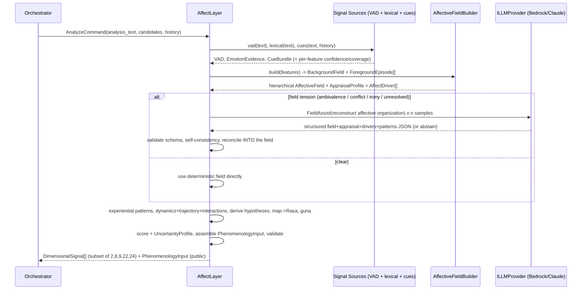
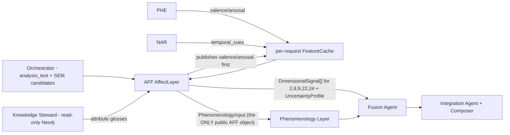

# Multi-Axis Affect (AFF) Layer — Design Document (Version 2.1)

> Implementation design for **Layer 1 — Multi-Axis Affect Analysis** of the Svarupa Assistant.
> This document turns the spec chapter (`Svarupa_Analytical_Layers_Technical_Specification.docx`,
> Layer 1) and the 31-Dimension Technical Specification into a concrete, buildable, clean/hexagonal
> Python design. It is the *architecture-before-code* artifact; no source files are created until
> this design is approved.
>
> **What changed in V2.** The layer's analytical philosophy was re-centered. V1 was emotion-first
> (`text → emotion models → emotion distribution → bridge → Rasa`). V2 reconstructs the
> **Affective Field** of the lived experience first, and treats emotion as a *derived hypothesis*
> over that field.
>
> **What V2.1 refines (this revision).** A focused refinement to better feed the downstream
> **Phenomenology (PHE)** layer while staying squarely on affective reconstruction: the
> `AffectiveField` becomes **hierarchical**; an **`AppraisalProfile`** and **`AffectDriver`s**
> explain *why* affect emerged; the field separates **background mood** from **foreground episodes**;
> **`ExperientialPattern`s** (withdrawal, striving, rumination, …) are recognised between field and
> emotion; **every reconstructed feature carries its own value, confidence, and evidence**; and a
> single curated **`PhenomenologyInput`** contract becomes the layer's public output so internal
> objects are never exposed directly. The hexagonal architecture, ports & adapters, explainability,
> confidence model, bridge tables, versioning, and testing strategy are all **preserved and
> extended** — this is a refinement, not a rewrite.

## Document Control

| Field | Value |
| --- | --- |
| Component | `svarupa_assistant_components/affect_analysis` |
| Layer code | `AFF` |
| Affinity set | `{2, 8, 9, 22, 24}` (primary D8, D9; contributing D2, D22, D24) |
| Document version | **v2.1** (field-first + hierarchical field + PhenomenologyInput); refines v2; supersedes v1 |
| Status | Design draft — v1 lean-first deterministic stack, v2/v2.1 analytical philosophy |
| Core representation | `AffectiveField` (immutable, **hierarchical**) — replaces VAD + EmotionDistribution as the canonical internal object |
| Public output | `PhenomenologyInput` (the only externally consumed object) + the shared `DimensionalSignal[]` fusion envelope |
| Source of truth | Analytical Layers Spec v1.0 §Layer 1; 31-Dimension Spec v7.1; `.cursor/rules/`; `AGENTS.md` |
| Runtime | Python `>=3.11,<3.14`, FastAPI, pydantic v2 |
| Non-negotiables | Recognition-not-diagnosis; relevance ≠ confidence; abstention is valid output; **field before emotion**; **reconstruct lived experience, do not classify emotions** |

### How to read this document

The doc follows the spec's 13-section chapter template, but each section states **implementation
decisions** — concrete classes, ports, schemas, file paths, math — rather than restating prose.
Where the spec and these decisions diverge (e.g. the lean-first model choices), the deviation is
called out explicitly with rationale.

**The reorientation, in one line.** *This layer reconstructs the affective organization of lived
experience rather than classifying emotions.* It builds a multi-dimensional, hierarchical field —
its background climate and foreground episodes, its appraisal structure, its drivers, its dynamics
over the narrative, and the interactions/tensions between coexisting affects — recognises the
**experiential patterns** the person is living, and only then reads emotion *hypotheses* off that
field and maps those onto the Rasa taxonomy. The pipeline is:

```
Text
  ↓  Affective features        (VAD, lexical affect, linguistic/agency/temporal/interaction cues — each value+confidence+evidence)
  ↓  Affective Field            (hierarchical: Core/Motivation/Regulation/Relational/Temporal/Uncertainty; background vs foreground; appraisal; drivers)
  ↓  Experiential Patterns      (withdrawal, openness, striving, rumination, hypervigilance, surrender, …)
  ↓  Emotion hypotheses         (derived, with evidence — never primary)
  ↓  Rasa mapping               (bridge tables: hypotheses → D8/D9 attributes)
  ↓  Dimensional Signals (fusion)  +  PhenomenologyInput (the curated public output for PHE)
```

---

## Architectural Principles

These are the binding design commitments for the AFF layer. They are stated once here and are
load-bearing throughout the document; every section, contract, and test below is an expression of
one or more of them. Where a feature and a principle ever conflict, **the principle wins**.

1. **Field-first.** Reconstruct the affective *field* before deriving any emotion. Emotion
   hypotheses, Rasa attributes, dynamics, and interactions are all derived from the
   `AffectiveField` — never the starting point. (See §1, §2.3, §5.0.)
2. **Recognition, not diagnosis.** Describe the experience *carried by the language*, never the
   person. Outputs are observations, hypotheses, and invitations — never labels, predictions,
   prescriptions, or verdicts. (See §0 cardinal rules, §6, §7.2.)
3. **Evidence everywhere.** Every reconstructed feature carries `value`, `confidence`, and
   `evidence` (provenance) — no bare numbers. Confidence and evidence propagate up the hierarchy and
   make every value traceable to text. (See §3.3.0, §4.2, §5.6, §7.2.)
4. **Hierarchy over flat vectors.** Affect is represented as an *organized structure*
   (Core / Motivation / Regulation / Relational / Temporal / Uncertainty; background vs foreground),
   not a bag of independent dimensions. (See §1, §3.3.)
5. **Stable contracts.** Downstream layers consume the curated, versioned `PhenomenologyInput` (and
   the shared `DimensionalSignal[]` fusion envelope) — never internal AFF models. Internals stay
   encapsulated behind the contract so both sides evolve independently. (See §3.4, §7.3.)
6. **Deterministic-first, LLM-assisted.** Deterministic reconstruction is the default path for the
   ~80–90% common case; the LLM is invoked *only* to resolve flagged ambiguity, behind a port, and
   never to classify emotions. (See §4, §6.)

---

## 0. Grounding (confirmed from the repository)

These facts are already true in the repo and constrain the design:

- **Affinity** `{2, 8, 9, 22, 24}` — the only `dimension_id`s AFF may emit. Primary for **D8
  Sthāyībhāvas** (9 enduring emotions) and **D9 Vyabhicārībhāvas** (33 transient states);
  contributing for **D2 Triguṇa**, **D22 Brahmavihāras**, **D24 Daivī/Āsurī Sampat**.
- **Canonical state poles** are `{deficiency, balance, excess}` (+ `unclear`), defined in
  [sql/001_svarupa_dimensions_concepts.sql](sql/001_svarupa_dimensions_concepts.sql)
  (`svarupa_status`, with `legacy_aliases` mapping `negative/neutral/positive`,
  `blocked/balanced/overactive`, etc. onto the triple).
- **D8 concepts are seeded** in SQL: `rati, hasa, shoka, krodha, utsaha, bhaya, jugupsa, vismaya,
  shama`. D9's 33 transient states and the remaining concept descriptions load from the corpus via
  ETL into `svarupa_concepts` / `svarupa_concept_descriptions`.
- **Infrastructure** (from [.env](.env)): Neo4j reached **read-only** through the Knowledge Steward;
  MySQL concept store (`svarupa_companion_v2` / dimension registry); Bedrock-Claude
  (`BEDROCK_MODEL_ID` = sonnet, `COT_SCORING_MODEL_ID` = haiku) behind a provider port;
  OpenTelemetry + structured JSON logs assumed.
- **Tooling** (`.cursor/rules/python-standards.mdc`): ruff (`E,W,F,I,C,B,UP`), black line-length 100,
  mypy strict, pytest with `pythonpath=["src"]`, `testpaths=["tests"]`.

### Cardinal rules carried into every section

1. **Recognition, not diagnosis.** Outputs are framed as "the language carries…", never as a
   verdict, label, prediction, or prescription about the person.
2. **Relevance vs confidence are two separate numbers, never collapsed.** `relevance ∈ [0,1]` =
   how strongly a dimension is implicated; `confidence ∈ [0,1]` = trust in the *process*. In V2 the
   single confidence scalar is *decomposed further* into a typed `UncertaintyProfile` (§3, §5) — the
   overall scalar still exists, but its sources are now explicit.
3. **Abstention is meaningful.** Absence of a signal for an in-affinity dimension = "assessed, not
   implicated"; out-of-affinity = "not assessed". Never fabricate a signal on thin input.
4. **Stay in your lane.** AFF emits only `{2, 8, 9, 22, 24}`. Dimensions are **data, not code** —
   no `if dimension == X` branching anywhere.
5. **Field before emotion (V2).** The `AffectiveField` is the canonical internal representation.
   Emotions, Rasa attributes, dynamics, and interactions are all *derived from* the field with
   traceable evidence. No component treats an emotion label as the primary object; emotion models
   are **supporting evidence** that feed field reconstruction, never the centre of the layer.
6. **Reconstruct lived experience, not emotion labels (V2.1).** Every section is written to the
   thesis: *this layer reconstructs the affective organization of lived experience rather than
   classifying emotions.* Emotion hypotheses, experiential patterns, appraisal, and drivers are all
   facets of that reconstruction — recognition, never diagnosis.
7. **Every reconstructed feature carries value + confidence + evidence (V2.1).** No bare numbers.
   Each axis/attribute is a `ReconstructedFeature{value, confidence, evidence}`; confidence and
   evidence propagate up the hierarchy into the field, the patterns, the hypotheses, and the
   `UncertaintyProfile`.
8. **Encapsulation: one public output (V2.1).** Internal AFF objects are never exposed directly.
   The layer's public surface for downstream consumers is the single curated `PhenomenologyInput`
   contract (§3), alongside the invariant `DimensionalSignal[]` fusion envelope.

---

## 1. Layer Overview

**What AFF is.** The specialist in the **affective organization of lived experience** — it
reconstructs that organization rather than classifying emotions. It builds a hierarchical
`AffectiveField` grouped into **Core affect** (valence, arousal, vitality, intensity),
**Motivation** (agency, approach, avoidance, control), **Regulation** (stability, persistence,
volatility, regulation), **Relational** (attachment, trust, social orientation), **Temporal**
(continuity, anticipation, resolution), and **Uncertainty** (ambiguity, confidence,
evidence_quality). It separates a persistent **background mood** from momentary **foreground
episodes**, reconstructs an **`AppraisalProfile`** and the **`AffectDriver`s** that explain *why*
the affect emerged, models the field's **dynamics** over the narrative (escalation, resolution,
oscillation, persistence, collapse, recovery) and the **interactions** between coexisting affects
(fear+hope, love+grief, relief+anxiety), and recognises the **`ExperientialPattern`s** the person is
living (withdrawal, openness, striving, rumination, hypervigilance, surrender, …). Only then does it
derive **emotion hypotheses** and map them onto the Rasa-theoretic dimensions: enduring emotions
(D8), transient states (D9), with contributing readings of guṇa coloration (D2) and relational/
character tone (D22, D24). It is **model-first, LLM-assisted**: deterministic signals build the
field for the ~80–90% common case; Claude (Bedrock) is invoked only to *reconstruct the field* for
flagged ambiguity (ambivalence, conflicting motivations, irony, unresolved/identity/relational
conflict).

**Objectives.** (1) Reconstruct the lived affective field, hierarchically and with per-feature
confidence/evidence. (2) Explain *why* affect is present (appraisal + drivers), not just *what* it
is. (3) Distinguish enduring climate (background) from situational reaction (foreground). (4)
Recognise experiential patterns that the Phenomenology layer needs to read experiential structure.
(5) Map to Rasa without flattening. (6) Hand downstream a single, curated, encapsulated
`PhenomenologyInput` — never raw internals.

**Why field-first (the V2 thesis).** Emotion classification is only *one interpretation* of an
affective field, and an early commitment to a single emotion label discards the very structure
Svarupa needs: the tension between coexisting feelings, the trajectory of affect across a story,
the difference between a settled disposition and a passing weather-front. By making the field the
canonical object and emotion a derived hypothesis, AFF preserves ambiguity and dynamics instead of
collapsing them — which is exactly what lets the Integration layer place a momentary feeling against
an enduring ground.

**What problem it solves.** Single-axis sentiment collapses emotional life into one number; even
multi-label emotion classification collapses a living field into a static category vote. AFF
preserves the distinctions Svarupa depends on — e.g. *Śoka-as-sacred-opening* (balance) vs
*Śoka-as-identity-collapse* (excess), enduring disposition vs transient weather, *hope shadowed by
fear* vs *hope* — by reconstructing the field and mapping it without flattening.

**Why it is irreducible.** No other layer reconstructs the affective field: PHE reads experiential
*structure*, PSY reads linguistic *form*, COT *reasons* (expensive, weaker fine-grained affect
calibration), SEM finds *topically* emotional concepts but does not measure the affect present.
AFF is the only layer that quantifies the organization of feeling along principled axes, models its
dynamics, and maps it to the Rasa taxonomy.

**Relationship to the Phenomenology layer (V2.1).** PHE reads the *structure* of experience and
depends on a faithful reconstruction of its *affective organization*. AFF therefore exposes a
dedicated, curated `PhenomenologyInput` (§3.4) — the hierarchical field, appraisal, trajectory,
interactions, drivers, experiential patterns, uncertainty, and an evidence summary — as its single
public object. AFF still reconstructs affect (its lane); it does not do phenomenological structure.
The contract is the seam: PHE consumes `PhenomenologyInput`, never AFF's internals.

**Design boundaries.**
- AFF reads only the *felt tone* for contributing dims (warmth/fear/anger for D22/D24, agitation/
  heaviness/equanimity for D2). Ethical/relational judgement and soteriological meaning belong to
  **COT**; experiential structure to **PHE**; linguistic form to **PSY**.
- Text-only in v1 (no prosody/physiology). Irony/sarcasm/idiom and affective conflict are detected
  as *ambiguity* and escalated to the LLM field-reconstruction assist rather than guessed.
- It reads affect from language — a *report* of feeling, not feeling itself — and frames every
  output accordingly.

**v1 scope decision (deviation from spec, by choice).** The spec describes a transformer VAD
regressor + multi-label emotion classifier. v1 ships a **lean deterministic stack** (VADER +
TextBlob for VAD, NRCLex for lexical affect, linguistic-cue heuristics for agency/temporal/
interaction) behind stable ports, all feeding the `AffectiveFieldBuilder`. Heavier transformer/ABSA
implementations drop in later as adapter swaps with **zero changes above `infrastructure/`**. Note
the V2 reframing: the discrete-emotion model is now a *supporting evidence source for the field*,
not the layer's centre. See §4 and §7 (Roadmap).

## 2. Architecture & Hexagonal Layering

### 2.1 Dependency rule

Dependencies point **inward**. `domain/` is pure (no I/O, no framework imports) and owns the
**ports** (Protocols) plus the immutable value objects. `infrastructure/` implements those ports as
adapters. `application/` holds the use case (`AffectLayer`) and the collaborators — the
`AffectiveFieldBuilder`, the `AppraisalReconstructor`, the `AffectDriverReconstructor`, the
`ExperientialPatternRecognizer`, the `EmotionHypothesisGenerator`, the `AffectDynamicsAnalyzer`,
and the `PhenomenologyInputAssembler` — and depends only on `domain` abstractions. `api/` is the
FastAPI edge and wires adapters into the use case via `Depends`. There is **no `if dimension == X`
branching** anywhere — dimension behavior comes from data (bridge tables, concept registry, pole
maps).

The structural change vs V1: the use case no longer calls emotion models and a bridge directly.
It calls **signal-source ports** that feed the `AffectiveFieldBuilder`; the resulting hierarchical
`AffectiveField` is the single object every downstream step reads; and the only object that leaves
the layer for downstream consumers is the curated `PhenomenologyInput` (plus the `DimensionalSignal`
fusion envelope).

```mermaid
flowchart TB
    subgraph api [api - FastAPI edge]
        Router["routes.py - POST /analyze"]
        Dtos["dtos.py - request/response + PhenomenologyInput DTO"]
        Deps["dependencies.py - DI wiring"]
    end
    subgraph app [application - use case + collaborators]
        UseCase["analyze_affect.py - AffectLayer.analyze"]
        FieldBuilder["field_builder.py - AffectiveFieldBuilder (background + foreground)"]
        Appraisal["appraisal.py - AppraisalReconstructor"]
        Drivers["drivers.py - AffectDriverReconstructor"]
        Patterns["patterns.py - ExperientialPatternRecognizer"]
        HypGen["hypotheses.py - EmotionHypothesisGenerator"]
        Dyn["dynamics.py - AffectDynamicsAnalyzer (dynamics + trajectory + interactions)"]
        Assembler["phenomenology_input.py - PhenomenologyInputAssembler"]
        Mappers["mappers.py - domain<->DTO"]
    end
    subgraph dom [domain - pure core + ports]
        Models["models.py - AffectiveField(hierarchical), AppraisalProfile, AffectDriver, ExperientialPattern, ForegroundEpisode, AffectTrajectory, AffectInteraction, UncertaintyProfile, EmotionHypothesis, PhenomenologyInput, DimensionalSignal, ReconstructedFeature"]
        Ports["ports.py - IVADModel, ILexicalAffect, ILinguisticCues, IEmotionEvidence, IBridgeTable, ILLMProvider, IKnowledgeSteward, IFeatureCache"]
        Scoring["scoring.py - field synthesis, aggregation, uncertainty, guna modulation, confidence propagation"]
        Enums["enums.py / exceptions.py"]
    end
    subgraph infra [infrastructure - adapters]
        Vad["affect/vader_textblob_vad.py - IVADModel"]
        Lex["affect/nrclex_lexical.py - ILexicalAffect"]
        Cues["affect/linguistic_cues.py - ILinguisticCues (agency/temporal/interaction/self-other)"]
        EmoEv["affect/emotion_evidence.py - IEmotionEvidence (supporting only)"]
        Fallback["affect/lexical_fallback.py"]
        Bridge["bridge/tables.py - IBridgeTable"]
        Llm["llm/bedrock_provider.py + prompts/ - ILLMProvider"]
        Kg["kg/steward_client.py - IKnowledgeSteward"]
        Cfg["config.py - pydantic-settings"]
    end

    Router --> UseCase
    UseCase --> FieldBuilder
    UseCase --> Appraisal
    UseCase --> Drivers
    UseCase --> Patterns
    UseCase --> HypGen
    UseCase --> Dyn
    UseCase --> Assembler
    UseCase --> Scoring
    Assembler -->|"PhenomenologyInput (public)"| Mappers
    FieldBuilder --> Ports
    Appraisal --> Ports
    Patterns --> Ports
    HypGen --> Ports
    Mappers --> Models
    Vad -. implements .-> Ports
    Lex -. implements .-> Ports
    Cues -. implements .-> Ports
    EmoEv -. implements .-> Ports
    Bridge -. implements .-> Ports
    Llm -. implements .-> Ports
    Kg -. implements .-> Ports
    Deps --> Vad
    Deps --> Lex
    Deps --> Cues
    Deps --> EmoEv
    Deps --> Bridge
    Deps --> Llm
    Deps --> Kg
```



### 2.2 Package layout

```
src/svarupa_affect/
  __init__.py
  api/
    routes.py          # POST /analyze  -> AnalyzeRequest -> AnalyzeResponse
    dtos.py            # pydantic v2 request/response (affect_input / affect_output)
    dependencies.py    # FastAPI Depends: build AffectLayer + collaborators with adapters from config
  application/
    analyze_affect.py  # AffectLayer implements IAnalyticalLayer; orchestrates the field-first pipeline
    field_builder.py   # AffectiveFieldBuilder: fuse signal sources -> hierarchical AffectiveField (background + foreground)
    appraisal.py       # AppraisalReconstructor: cues + field -> AppraisalProfile
    drivers.py         # AffectDriverReconstructor: appraisal + cues + context -> AffectDriver[]
    patterns.py        # ExperientialPatternRecognizer: field -> ExperientialPattern[]
    hypotheses.py      # EmotionHypothesisGenerator: AffectiveField + patterns -> EmotionHypothesis[]
    dynamics.py        # AffectDynamicsAnalyzer: foreground episodes -> AffectDynamics + AffectTrajectory + AffectInteraction[]
    phenomenology_input.py # PhenomenologyInputAssembler: assemble the single curated public output
    mappers.py         # domain <-> response DTO (PhenomenologyInput DTO + DimensionalSignal envelope)
  domain/
    models.py          # ReconstructedFeature; CoreAffect/Motivation/Regulation/Relational/Temporal/FieldUncertainty;
                       #   AffectiveField(hierarchical), ForegroundEpisode, AppraisalProfile, AffectDriver,
                       #   ExperientialPattern, AffectDynamics, AffectTrajectory, AffectInteraction,
                       #   UncertaintyProfile, EmotionHypothesis, EvidenceSummary, PhenomenologyInput,
                       #   DimensionalSignal, LayerContext, VAD, Evidence, AttributeScore, StateHint
                       #   (all immutable, versioned, timestamped value objects)
    ports.py           # Protocols: IVADModel, ILexicalAffect, ILinguisticCues, IEmotionEvidence,
                       #            IBridgeTable, ILLMProvider, IKnowledgeSteward, IFeatureCache
    enums.py           # StatePole, Durability, EvidenceKind, LatencyMode, UncertaintyType,
                       #   DynamicsPattern, MotivationalDirection, FieldAxis, ExperientialPatternType
    scoring.py         # pure math: field synthesis weights, saturate, max-pool relevance,
                       #   pole map, guna mod, per-feature + uncertainty-profile confidence propagation
    invariants.py      # shared domain-invariant mixins/validators (frozen, versioned, timestamped)
    exceptions.py      # AffectError, ModelUnavailable, SchemaValidationError, AbstainSignal
  infrastructure/
    affect/
      vader_textblob_vad.py   # IVADModel       (VADER + TextBlob -> valence/arousal/dominance proxy)
      nrclex_lexical.py       # ILexicalAffect  (NRCLex -> lexical affect evidence for the field)
      linguistic_cues.py      # ILinguisticCues (agency / temporal / interaction / self-other cues)
      emotion_evidence.py     # IEmotionEvidence (discrete-emotion probs as SUPPORTING evidence only)
      lexical_fallback.py     # reduced-confidence path on validation/model failure
    bridge/
      tables.py               # IBridgeTable: loads/validates versioned hypotheses->Rasa JSON
    llm/
      bedrock_provider.py     # ILLMProvider via langchain-aws / boto3
      prompts/field_assist.py # pinned prompt_version + system contract + field-reconstruction JSON schema
    kg/
      steward_client.py       # IKnowledgeSteward: read-only Neo4j attribute glosses (cached)
    config.py                 # pydantic-settings reading SVARUPA_* env vars
data/
  bridge/
    hyp2sthayi.v2.json        # EMO_HYP2STHAYI bridge (hypotheses -> D8); the single editable artifact
    hyp2vyabhi.v2.json        # EMO_HYP2VYABHI bridge (hypotheses -> D9)
  pole_maps/
    d8_poles.v1.json          # per-attribute status->{deficiency,balance,excess} rules
  field/
    field_synthesis.v1.json   # per-axis source weights for AffectiveFieldBuilder (versioned)
    interactions.v1.json      # known affect-interaction templates (fear+hope, love+grief, ...)
    appraisal_rules.v1.json   # cue/axis -> appraisal-dimension rules (novelty, goal_congruence, ...)
    patterns.v1.json          # field-region -> ExperientialPattern signatures (withdrawal, striving, ...)
  ground_truth/
    affect_gold.jsonl         # gold eval cases (+ schema): field axes, appraisal, patterns, dynamics, dominant attribute
tests/
  test_field_builder.py  test_appraisal.py  test_patterns.py  test_drivers.py
  test_dynamics.py  test_bridge.py  test_pole_map.py  test_uncertainty.py
  test_phenomenology_input.py  test_invariants.py
  test_llm_failure.py    test_property_invariants.py  test_philosophy_regression.py
pyproject.toml                # deps + ruff/black(100)/mypy strict/pytest config
```

### 2.3 Processing pipeline (field-first: 11 steps, 2 gates, 1 fallback)

The pipeline reconstructs lived experience before reading any emotion. Steps 1–3 gather **affective
features** (each value+confidence+evidence); step 4 **reconstructs the hierarchical
`AffectiveField`**, separating **background** climate from **foreground episodes**; steps 5–6 add
the **appraisal** and **drivers** that explain *why* the affect is present; step 7 reconstructs
**dynamics/trajectory/interactions**; step 8 recognises **experiential patterns**; only then (step
9) are emotion hypotheses derived, mapped to Rasa (step 10), and assembled into the curated
`PhenomenologyInput` + scored signals (step 11). The ambiguity gate fires on *field-level* tensions,
and the LLM assist *reconstructs the field*, not an emotion label.

```mermaid
flowchart TD
    Start["AnalyzeCommand - analysis_text, candidate_dimensions, history"] --> S1["1. Segment + target detection - clauses/turns, self/other/situation"]
    S1 --> S2["2. Affective features - VAD + lexical affect + linguistic/agency/temporal/interaction cues (each value+confidence+evidence)"]
    S2 --> S3["3. Emotion evidence (supporting) - discrete-emotion probs as ONE input, never primary"]
    S3 --> S4["4. Affective Field reconstruction - hierarchical field; BackgroundField (climate) + ForegroundEpisode[] (momentary)"]
    S4 --> S5["5. Appraisal reconstruction - AppraisalProfile (novelty, goal_congruence, controllability, ...)"]
    S5 --> S6["6. Driver reconstruction - AffectDriver[] (trigger, appraisal, causal/maintaining/contextual factors)"]
    S6 --> G1{"7. Ambiguity gate - ambivalence / motivational conflict / co-present +/- affect / irony / unresolved / identity or relational conflict?"}
    G1 -->|ambiguous| Assist["7b. LLM Field Assist - reconstruct the affective organization (constrained JSON, self-consistency, reconcile into field+appraisal+drivers)"]
    G1 -->|clear| S7
    Assist --> S7["8. Dynamics + trajectory + interactions - foreground episodes -> AffectDynamics, AffectTrajectory, AffectInteraction[]"]
    S7 --> S8["9. Experiential patterns - ExperientialPatternRecognizer reads patterns off the field (withdrawal/striving/rumination/...)"]
    S8 --> S9["10. Emotion hypotheses - read off field+patterns with evidence (derived, never primary)"]
    S9 --> S10["11. Map hypotheses -> Rasa - hyp2sthayi (D8) + hyp2vyabhi (D9) + durability; guna (D2); relational tone (D22/D24)"]
    S10 --> S11["12. Score + UncertaintyProfile + assemble PhenomenologyInput"]
    S11 --> G2{"Validation gate - ranges, schema, attr registry, monotonicity, field-axis bounds, per-feature confidence present"}
    G2 -->|pass| Emit["Emit DimensionalSignal[] for subset of 2,8,9,22,24 + PhenomenologyInput (public)"]
    G2 -->|fail| FB["Lexical fallback - degraded field, reduced confidence"]
    FB --> Emit
    G2 -->|total failure| Absent["Emit nothing - layer absent, lowers downstream coverage"]
```



**Decision points.** (a) *Ambiguity gate* (step 7, expanded in §6.1): fires on field-level tension —
high `ambivalence`/`emotional_complexity`, `motivational_conflict`, simultaneous positive and
negative affect, unresolved affect, identity/relational conflict — as well as the classic
irony/sarcasm and signal-disagreement triggers. (b) *Validation gate* (step 12): range checks
(`[0,1]`, VAD/field-axis bounds), JSON-schema validation, attribute-name validation against the
concept registry, a **monotonicity check** (`state=excess` requires arousal/intensity above the
balance band), and a **per-feature-confidence check** (every `ReconstructedFeature` carries a
confidence + evidence).

**Error handling / degradation** (per `python-standards.mdc` + `llm-usage.mdc`):
signal-source error → 1 retry → that axis marked low-coverage in the field (the field still builds
from remaining sources); LLM-assist schema failure → ≤2 repair re-prompts → drop assist, proceed
deterministic-field-only; LLM timeout → deterministic field, affected axes/dims `unclear` with
`MODEL` + `INSUFFICIENT_CONTEXT` uncertainty raised; total failure → emit nothing (never a guess).
All collaborators are async and run under explicit per-call timeouts; signal sources and
self-consistency samples are issued concurrently via `asyncio.gather`.

## 3. Contracts & Schemas

All DTOs and domain models are **pydantic v2**; all LLM output is validated against a JSON Schema
before use (`python-standards.mdc`). Enums are closed and live in `domain/enums.py`.

### 3.1 Enums (`domain/enums.py`)

```python
from enum import StrEnum

class StatePole(StrEnum):           # canonical triple + unclear (matches svarupa_status)
    DEFICIENCY = "deficiency"
    BALANCE = "balance"
    EXCESS = "excess"
    UNCLEAR = "unclear"

class Durability(StrEnum):
    ENDURING = "enduring"
    TRANSIENT = "transient"
    MIXED = "mixed"
    UNKNOWN = "unknown"

class EvidenceKind(StrEnum):
    SPAN = "span"
    AXIS = "axis"                   # an AffectiveField axis value
    FIELD = "field"                 # the field as a whole / a field region
    EMOTION = "emotion"             # a derived emotion hypothesis (supporting)
    INTERACTION = "interaction"     # an affect interaction / tension
    DYNAMICS = "dynamics"           # a trajectory pattern / transition
    MAPPING_PATH = "mapping_path"   # hypothesis -> bridge edge -> attribute

class LatencyMode(StrEnum):
    FAST = "fast"
    STANDARD = "standard"
    DEEP = "deep"

class FieldAxis(StrEnum):           # canonical hierarchical AffectiveField axes ("group.attr"; data, not code)
    # Core affect
    CORE_VALENCE = "core.valence"
    CORE_AROUSAL = "core.arousal"
    CORE_VITALITY = "core.vitality"
    CORE_INTENSITY = "core.intensity"
    # Motivation
    MOT_AGENCY = "motivation.agency"
    MOT_APPROACH = "motivation.approach"
    MOT_AVOIDANCE = "motivation.avoidance"
    MOT_CONTROL = "motivation.control"
    # Regulation
    REG_STABILITY = "regulation.stability"
    REG_PERSISTENCE = "regulation.persistence"
    REG_VOLATILITY = "regulation.volatility"
    REG_REGULATION = "regulation.regulation"
    # Relational
    REL_ATTACHMENT = "relational.attachment"
    REL_TRUST = "relational.trust"
    REL_SOCIAL_ORIENTATION = "relational.social_orientation"
    # Temporal
    TMP_CONTINUITY = "temporal.continuity"
    TMP_ANTICIPATION = "temporal.anticipation"
    TMP_RESOLUTION = "temporal.resolution"
    # Uncertainty facet of the field
    UNC_AMBIGUITY = "uncertainty.ambiguity"
    UNC_CONFIDENCE = "uncertainty.confidence"
    UNC_EVIDENCE_QUALITY = "uncertainty.evidence_quality"

class MotivationalDirection(StrEnum):  # derived from motivation.approach vs motivation.avoidance
    APPROACH = "approach"
    AVOID = "avoid"
    CONFLICTED = "conflicted"
    NEUTRAL = "neutral"

class ExperientialPatternType(StrEnum):   # the lived stance recognised between field and emotion
    WITHDRAWAL = "withdrawal"
    OPENNESS = "openness"
    STRIVING = "striving"
    AVOIDANCE = "avoidance"
    RUMINATION = "rumination"
    HYPERVIGILANCE = "hypervigilance"
    SURRENDER = "surrender"
    RESISTANCE = "resistance"
    ATTACHMENT = "attachment"
    DETACHMENT = "detachment"

class DynamicsPattern(StrEnum):     # how the field changes across the narrative
    ESCALATION = "escalation"       # e.g. fear -> panic
    RESOLUTION = "resolution"       # e.g. anger -> acceptance
    OSCILLATION = "oscillation"     # e.g. hope -> fear -> hope
    PERSISTENCE = "persistence"     # e.g. sadness sustained throughout
    COLLAPSE = "collapse"           # e.g. confidence suddenly disappears
    RECOVERY = "recovery"           # e.g. distress gradually reduces
    STABLE = "stable"               # little change

class UncertaintyType(StrEnum):     # the typed sources of uncertainty (kept independent)
    MODEL = "model"                 # model/extractor uncertainty
    INPUT_AMBIGUITY = "input_ambiguity"
    MIXED_AFFECT = "mixed_affect"
    CONTRADICTORY_EVIDENCE = "contradictory_evidence"
    IRONY = "irony"
    INSUFFICIENT_CONTEXT = "insufficient_context"
    COVERAGE = "coverage"
```

### 3.2 The analytical-layer port (`domain/ports.py`)

The invariant contract every Svarupa layer implements. AFF's `AffectLayer` (in `application/`)
satisfies it.

```python
from typing import Protocol

class IAnalyticalLayer(Protocol):
    code: str                 # "AFF"
    version: str              # semver, recorded in provenance
    affinity: frozenset[int]  # frozenset({2, 8, 9, 22, 24})
    async def analyze(self, ctx: "LayerContext") -> list["DimensionalSignal"]: ...
```

Contract obligations enforced in code: emit signals **only** for `dimension_id in affinity`;
attach `provenance` + process-`confidence` to every signal; **never** emit a label/prediction/
prescription; treat absence of an in-affinity signal as meaningful abstention.

### 3.3 Domain models (`domain/models.py`)

#### 3.3.0 Domain invariants (V2.1)

Every **core** domain object (`AffectiveField` and its sub-fields, `AppraisalProfile`,
`AffectDriver`, `ExperientialPattern`, `ForegroundEpisode`, `AffectTrajectory`, `AffectInteraction`,
`EmotionHypothesis`, `UncertaintyProfile`, `PhenomenologyInput`) obeys these invariants, enforced by
a shared base (`domain/invariants.py`) and asserted in `test_invariants.py`:

| Invariant | Mechanism |
| --- | --- |
| **Immutable** | `model_config = ConfigDict(frozen=True)`; objects are replaced, never mutated |
| **Versioned** | `schema_version: str` (semver of the object's shape) recorded on every instance |
| **Timestamped** | `created_at: datetime` (UTC) for replay/audit ordering |
| **Carries uncertainty** | a `confidence ∈ [0,1]` (leaf features) or an embedded `UncertaintyProfile`/`evidence_quality` (composites) — never a bare number |
| **Carries evidence provenance** | `evidence: list[Evidence]` (spans + source + weight) so any value is traceable to text |

```python
class _Core(_Frozen):
    """Shared invariants for every core domain object: immutable + versioned + timestamped."""
    schema_version: str
    created_at: datetime
```

All value objects are **immutable** (`frozen=True`). The V2.1 centre is a **hierarchical**
`AffectiveField`; `VAD` survives only as **one contributor**, the old `EmotionDist` is demoted to a
supporting `EmotionEvidence`, and **every reconstructed attribute is a `ReconstructedFeature` that
bundles its value with its own confidence and evidence**.

```python
from datetime import datetime
from pydantic import BaseModel, ConfigDict, Field

class _Frozen(BaseModel):
    model_config = ConfigDict(frozen=True)

# --- the universal reconstructed-feature wrapper (V2.1) --------------------------
class ReconstructedFeature(_Frozen):
    """Every reconstructed attribute carries its value, its own confidence, and evidence.
    No bare numbers anywhere in the field hierarchy."""
    value: float                            # range validated by the owning group/axis
    confidence: float = Field(ge=0.0, le=1.0)
    evidence: list["Evidence"] = []

class Evidence(_Frozen):
    kind: EvidenceKind
    detail: str
    span: tuple[int, int] | None = None     # char offsets into analysis_text
    source: str | None = None               # which signal source / inference produced it
    weight: float = Field(default=1.0, ge=0.0, le=1.0)

# --- low-level contributors (no longer the centre) ------------------------------
class VAD(_Frozen):
    valence: float = Field(ge=-1.0, le=1.0)
    arousal: float = Field(ge=0.0, le=1.0)
    dominance: float = Field(ge=0.0, le=1.0)

class EmotionEvidence(_Frozen):
    """Discrete-emotion probabilities — SUPPORTING evidence for the field, not a result."""
    probs: dict[str, float]                 # label -> prob (softmax-normalized)
    margin: float = Field(ge=0.0, le=1.0)   # top1 - top2; feeds ambiguity + MODEL uncertainty

# --- V2.1 CORE: the hierarchical AffectiveField ---------------------------------
# Each sub-group bundles ReconstructedFeatures so confidence/evidence live with every value.
class CoreAffect(_Frozen):
    valence: ReconstructedFeature           # value ∈ [-1,1]
    arousal: ReconstructedFeature           # [0,1]
    vitality: ReconstructedFeature          # aliveness vs depletion
    intensity: ReconstructedFeature

class Motivation(_Frozen):
    agency: ReconstructedFeature
    approach: ReconstructedFeature
    avoidance: ReconstructedFeature
    control: ReconstructedFeature
    # direction/conflict are DERIVED (not stored) from approach vs avoidance:
    @property
    def direction(self) -> MotivationalDirection: ...
    @property
    def conflict(self) -> float: ...        # min(approach, avoidance) magnitude

class Regulation(_Frozen):
    stability: ReconstructedFeature
    persistence: ReconstructedFeature
    volatility: ReconstructedFeature
    regulation: ReconstructedFeature        # contained vs flooded

class Relational(_Frozen):
    attachment: ReconstructedFeature
    trust: ReconstructedFeature
    social_orientation: ReconstructedFeature  # value ∈ [-1,1] toward(+)/away(-)

class Temporal(_Frozen):
    continuity: ReconstructedFeature        # tied to a moment vs ongoing
    anticipation: ReconstructedFeature      # future-leaning affect
    resolution: ReconstructedFeature        # resolved vs open

class FieldUncertainty(_Frozen):
    """The field's own uncertainty facet (distinct from the layer-level UncertaintyProfile)."""
    ambiguity: ReconstructedFeature
    confidence: ReconstructedFeature        # aggregate field confidence
    evidence_quality: ReconstructedFeature

class AffectiveField(_Core):
    """The reconstructed affective organization of lived experience — hierarchical.
    Used for both the BackgroundField (climate) and each ForegroundEpisode snapshot."""
    core: CoreAffect
    motivation: Motivation
    regulation: Regulation
    relational: Relational
    temporal: Temporal
    uncertainty: FieldUncertainty
    # per-axis coverage (fired-fraction) keyed by the hierarchical FieldAxis — COVERAGE uncertainty
    axis_coverage: dict[FieldAxis, float] = {}
    # provenance of contributions: axis -> {source_name: contribution_weight}
    contributions: dict[FieldAxis, dict[str, float]] = {}
    evidence: list[Evidence] = []
    # DERIVED cross-group scalars (computed, never stored) — used by the gate/scoring/bridge:
    @property
    def motivational_direction(self) -> MotivationalDirection: ...  # = self.motivation.direction
    @property
    def motivational_conflict(self) -> float: ...                   # = self.motivation.conflict
    @property
    def ambivalence(self) -> float: ...        # co-present opposed valence across episodes
    @property
    def emotional_complexity(self) -> float: ...  # number/spread of coexisting affects
    @property
    def temporal_continuity(self) -> float: ...   # = self.temporal.continuity.value

# --- V2.1: WHY affect emerged (appraisal + drivers) -----------------------------
class AppraisalProfile(_Core):
    """Cognitive appraisal structure that shapes the field (appraisal theory, Scherer)."""
    novelty: ReconstructedFeature
    goal_congruence: ReconstructedFeature   # value ∈ [-1,1]
    controllability: ReconstructedFeature
    expectedness: ReconstructedFeature
    responsibility: ReconstructedFeature    # self / other / circumstance leaning
    certainty: ReconstructedFeature
    fairness: ReconstructedFeature          # value ∈ [-1,1]
    agency: ReconstructedFeature
    evidence: list[Evidence] = []

class AffectDriver(_Core):
    """Why a given affect is present — reconstructed, recognition-framed, never diagnostic."""
    trigger: str                            # the proximate situational trigger (templated)
    appraisal: AppraisalProfile | None = None
    causal_factor: str | None = None        # what brought it about
    maintaining_factor: str | None = None   # what keeps it going (e.g. rumination)
    contextual_factor: str | None = None    # background conditions
    confidence: float = Field(ge=0.0, le=1.0)
    evidence: list[Evidence] = []

# --- V2.1: the lived stance, between field and emotion --------------------------
class ExperientialPattern(_Core):
    """A recognised stance the person is living (withdrawal, striving, rumination, ...)."""
    type: ExperientialPatternType
    strength: ReconstructedFeature
    supporting_axes: list[FieldAxis] = []
    evidence: list[Evidence] = []

# --- background vs foreground (V2.1) --------------------------------------------
class ForegroundEpisode(_Core):
    """A momentary affective reaction tied to a span, with its own field + drivers + patterns."""
    field: AffectiveField                   # the episode's local field snapshot
    span: tuple[int, int]
    drivers: list[AffectDriver] = []
    patterns: list[ExperientialPattern] = []
# BackgroundField is an AffectiveField representing the persistent climate (alias by role).

# --- emotion is DERIVED from field + patterns -----------------------------------
class EmotionHypothesis(_Core):
    """A hypothesis read off the field (+ patterns). Never the primary representation."""
    label: str                              # Plutchik+Rasa-aligned label
    probability: float = Field(ge=0.0, le=1.0)
    durability: Durability
    supporting_axes: list[FieldAxis] = []
    supporting_patterns: list[ExperientialPatternType] = []
    evidence: list[Evidence] = []

# --- dynamics, trajectory, interactions -----------------------------------------
class AffectInteraction(_Core):
    """A first-class construct for coexisting affects (fear+hope, love+grief, ...)."""
    components: tuple[str, ...]
    is_tension: bool
    strength: float = Field(ge=0.0, le=1.0)
    description: str                        # templated, recognition-framed
    evidence: list[Evidence] = []

class FieldTransition(_Frozen):
    from_label: str
    to_label: str
    pattern: DynamicsPattern
    span: tuple[int, int] | None = None

class AffectDynamics(_Frozen):
    patterns: list[DynamicsPattern] = []
    transitions: list[FieldTransition] = []

class AffectTrajectory(_Core):
    """The ordered affective path across foreground episodes; handed downstream."""
    sequence: list[ForegroundEpisode] = []  # ordered episodes
    transitions: list[FieldTransition] = []
    turning_points: list[int] = []
    persistence: float = Field(ge=0.0, le=1.0)
    reversals: int = 0
    volatility: float = Field(ge=0.0, le=1.0)

# --- typed uncertainty (overall scalar still derived from it) -------------------
class UncertaintyProfile(_Core):
    components: dict[UncertaintyType, float] = {}   # each in [0,1], independent
    def overall_confidence(self) -> float: ...      # see scoring.py (§5.6)

# --- evidence summary for the public contract -----------------------------------
class EvidenceSummary(_Core):
    """A compact, public-facing roll-up of the evidence base (no raw internal traces)."""
    spans: list[tuple[int, int]] = []
    n_features: int = 0
    mean_feature_confidence: float = Field(ge=0.0, le=1.0)
    coverage: float = Field(ge=0.0, le=1.0)
    quality: float = Field(ge=0.0, le=1.0)

# --- THE single public output (V2.1) --------------------------------------------
class PhenomenologyInput(_Core):
    """The ONLY object AFF exposes to downstream consumers (esp. the Phenomenology layer).
    Internal AFF objects are never exposed directly; this is the curated contract."""
    request_id: str
    layer_version: str
    background_field: AffectiveField            # persistent affective climate
    foreground_episodes: list[ForegroundEpisode] = []
    appraisal: AppraisalProfile
    trajectory: AffectTrajectory
    interactions: list[AffectInteraction] = []
    drivers: list[AffectDriver] = []
    experiential_patterns: list[ExperientialPattern] = []
    uncertainty: UncertaintyProfile
    evidence_summary: EvidenceSummary
    provenance: "Provenance"

# --- scoring leaf objects + shared fusion envelope ------------------------------
class AttributeScore(_Frozen):
    attribute: str
    relevance: float = Field(ge=0.0, le=1.0)
    state: StatePole

class StateHint(_Frozen):
    state: StatePole
    confidence: float = Field(ge=0.0, le=1.0)

class DimensionalSignal(_Core):
    """The shared envelope, invariant across all seven layers (fusion contract)."""
    request_id: str
    layer: str = "AFF"
    layer_version: str
    dimension_id: int                       # MUST be in affinity
    relevance: float = Field(ge=0.0, le=1.0)
    confidence: float = Field(ge=0.0, le=1.0)  # process trust, NEVER fused with relevance
    uncertainty: UncertaintyProfile | None = None
    attribute_scores: list[AttributeScore] = []
    state_hint: StateHint | None = None
    evidence: list[Evidence] = []
    abstained: bool = False
    provenance: "Provenance"

class LayerContext(_Frozen):
    request_id: str
    analysis_text: str = Field(min_length=1)
    locale: str = "en"
    conversation_history: list[dict[str, str]] = []
    candidate_dimensions: list[int] = []
    shared_features: "SharedFeatures | None" = None  # PHE valence/arousal, NAR temporal_cues
    kg_context: dict[str, str] = {}
    latency_mode: LatencyMode = LatencyMode.STANDARD
    enable_llm_assist: bool = True
```

`Provenance` carries `layer_version, model_id, prompt_version, bridge_table_version,
field_synthesis_version, appraisal_rules_version, patterns_version, timestamp, samples` and is
persisted for replay (architecture spec §13.1 / §12). The **only** objects that leave the layer are
the `PhenomenologyInput` (public, for PHE and other consumers) and the `DimensionalSignal[]` fusion
envelope; the hierarchical field and its internals are reached *only* through `PhenomenologyInput`.

### 3.4 Input / output JSON schemas

The API DTOs mirror the spec's `affect_input.json` / `affect_output.json` one-to-one. Key points:

- **Input** (`AnalyzeRequest`): `request_id (uuid)`, `analysis_text (minLength 1)`, optional
  `locale`, `conversation_history`, `shared_features {valence∈[-1,1], arousal∈[0,1],
  temporal_cues[]}`, `candidate_dimensions[]`, `kg_context`, `options {latency_mode,
  enable_llm_assist}`.
- **Output** (`AnalyzeResponse`): `request_id`, `layer="AFF"`, `layer_version`, `signals[]`
  (each constrained to `dimension_id ∈ {2,8,9,22,24}`, with `attribute_scores`, `state_hint`,
  `uncertainty`, `evidence`, `abstained`), the **`phenomenology_input`** object (the curated public
  contract, §3.3), and `provenance`.

#### 3.4.1 `PhenomenologyInput` — the single public output (V2.1)

In V2 the response dumped internal objects into a free-form `intermediate` block. **V2.1 replaces
that with one curated, versioned contract**, so internal AFF objects are never exposed directly and
downstream layers depend on a stable surface, not on AFF internals:

| `PhenomenologyInput` field | Purpose for PHE / downstream |
| --- | --- |
| `background_field: AffectiveField` | the persistent affective climate (hierarchical) |
| `foreground_episodes: ForegroundEpisode[]` | momentary reactions (field snapshot + span + drivers + patterns) |
| `appraisal: AppraisalProfile` | *why* the affect arises (novelty, goal-congruence, controllability, …) |
| `trajectory: AffectTrajectory` | movement across episodes (escalation/collapse/recovery, turning points) |
| `interactions: AffectInteraction[]` | coexisting affects and tensions |
| `drivers: AffectDriver[]` | trigger + causal/maintaining/contextual factors |
| `experiential_patterns: ExperientialPattern[]` | lived stance (withdrawal, striving, rumination, …) |
| `uncertainty: UncertaintyProfile` | typed uncertainty for principled downstream discounting |
| `evidence_summary: EvidenceSummary` | compact, public-facing evidence roll-up (no raw traces) |

**Encapsulation rule.** The hierarchical field and all internal collaborators are reachable *only*
through `PhenomenologyInput`. The `DimensionalSignal[]` envelope remains the **fusion** contract
(unchanged shape); `PhenomenologyInput` is the **Phenomenology/consumer** contract. Both are
versioned (`schema_version`) and provenance-stamped, always emitted (even on abstention, with empty
collections and raised uncertainty), and used for golden-transaction replay. Signals are the
*projection* of the field onto the Rasa dimensions, not a parallel representation.

## 4. Affective Signal Sources, Field Builder & Bridge Tables

V2 reframes this section: the deterministic stack is no longer "the emotion models" but a set of
**low-level affective signal sources** that all feed one component — the `AffectiveFieldBuilder`.
Emotion is produced *after* the field, by the `EmotionHypothesisGenerator`, and the bridge maps
**hypotheses** (not raw classifier output) onto Rasa.

### 4.1 Ports (the seam that makes lean-first safe)

The signal-source ports are deliberately granular so the field can be built from many weak signals
and so each can be swapped independently. Swapping VADER/NRCLex for transformer models later touches
**only** `infrastructure/affect/`.

```python
class IVADModel(Protocol):
    async def score(self, text: str) -> tuple[VAD, float]: ...        # (vad, coverage∈[0,1])

class ILexicalAffect(Protocol):
    """Lexical affect evidence (NRCLex et al.) — a CONTRIBUTOR to the field, not a result."""
    async def signals(self, text: str) -> tuple[EmotionEvidence, float]: ...  # (evidence, coverage)

class ILinguisticCues(Protocol):
    """Agency / temporal / interaction / self-other cues that feed non-VAD field axes."""
    async def cues(self, text: str, history: list[dict[str, str]]) -> "CueBundle": ...

class IEmotionEvidence(Protocol):
    """Optional discrete-emotion probabilities used ONLY as supporting evidence for the field."""
    async def classify(self, text: str) -> tuple[EmotionEvidence, float]: ...

class IBridgeTable(Protocol):
    version: str
    def map(self, hypotheses: list[EmotionHypothesis],
            field: AffectiveField) -> list[AttributeScore]: ...   # hypotheses -> Rasa

class IKnowledgeSteward(Protocol):
    async def glosses(self, dimension_id: int, attributes: list[str]) -> dict[str, str]: ...

class ILLMProvider(Protocol):
    async def complete_json(self, *, system: str, prompt: str, schema: dict,
                            model_id: str, temperature: float, timeout_s: float) -> dict: ...
```

### 4.2 The `AffectiveFieldBuilder` (application/field_builder.py)

The builder is the centre of the layer. It **aggregates the affective features into the hierarchical
`AffectiveField`**, producing a `ReconstructedFeature{value, confidence, evidence}` for *each* axis
and attributing every axis to its contributing sources (for explainability and COVERAGE
uncertainty). Source → group mapping:

- VAD (`IVADModel`) → `core.valence`, `core.arousal`, (proxy) `motivation.control`;
- lexical affect (`ILexicalAffect`) + optional emotion evidence (`IEmotionEvidence`) →
  `core.intensity`, `core.vitality`, and ambivalence/complexity support;
- linguistic/agency cues (`ILinguisticCues`) → `motivation.agency/approach/avoidance`,
  `regulation.*`, `relational.attachment/trust/social_orientation`, `uncertainty.*`;
- temporal cues (NAR `temporal_cues` via the feature cache) → `temporal.continuity/anticipation/
  resolution`, `regulation.persistence`;
- conversation context → disambiguation only (never overrides the present expression).

**Per-feature confidence (V2.1).** Each `ReconstructedFeature.confidence` = `f(source agreement on
that axis, coverage, evidence weight)`; this is the leaf from which the field's
`uncertainty.confidence`, the experiential-pattern strengths, the hypothesis probabilities, and the
layer `UncertaintyProfile` all propagate (§5.6). Axis synthesis is **data-driven**: per-axis source
weights live in `data/field/field_synthesis.v1.json` (versioned, in provenance); each axis value is
`Σ_src w(axis,src)·signal(src)` normalized by fired coverage, and `axis_coverage[axis]` records that
fired-fraction.

**Background vs foreground (V2.1).** The builder reconstructs **two views**:
- a **`BackgroundField`** — the persistent affective *climate*: the central tendency of the axes
  across the whole expression/history (low-volatility, high-persistence reading), representing the
  enduring ground;
- a list of **`ForegroundEpisode`s** — momentary reactions tied to spans/segments, each a local
  `AffectiveField` snapshot plus its drivers and patterns.
The split is what lets PHE and Integration distinguish a settled mood from a situational spike; the
foreground episodes are also the `sequence` consumed by the `AffectTrajectory` (§5.7).

### 4.2a Appraisal & drivers (application/appraisal.py, drivers.py)

To explain *why* affect is present (not just what it is), two collaborators run on the field:

- **`AppraisalReconstructor`** produces the immutable `AppraisalProfile` (novelty, goal_congruence,
  controllability, expectedness, responsibility, certainty, fairness, agency) from linguistic cues
  + field axes, via versioned rules in `data/field/appraisal_rules.v1.json`. **Appraisal feeds back
  into field reconstruction**: e.g. low `controllability` + negative `goal_congruence` raises
  `core.arousal`/`motivation.avoidance` priors; high `responsibility`-to-self biases relational and
  regulation axes. Each appraisal dimension is itself a `ReconstructedFeature`.
- **`AffectDriverReconstructor`** produces `AffectDriver[]` — `trigger`, the contributing
  `AppraisalProfile`, and `causal_factor` / `maintaining_factor` / `contextual_factor` — recognition
  framed ("the language ties this to…"), never causal claims about the person. Drivers are attached
  to the foreground episodes they explain and passed downstream in `PhenomenologyInput`.

### 4.3 v1 deterministic adapters (lean) — now feeding the field

| Port | v1 adapter | Library | What it contributes to the field | Notes |
| --- | --- | --- | --- | --- |
| `IVADModel` | `vader_textblob_vad.py` | `vaderSentiment`, `textblob` | valence (VADER compound→[-1,1]); arousal (intensifier/exclamation density + subjectivity); dominance proxy | dominance coarse in v1; low-coverage on terse text |
| `ILexicalAffect` | `nrclex_lexical.py` | `nrclex` | lexical affect → intensity, complexity, ambivalence support | not an output; a field contributor |
| `ILinguisticCues` | `linguistic_cues.py` | `spacy` (small) / rules | agency, certainty, regulation, motivational direction/conflict, self-other, temporal | the source for the **non-VAD** axes |
| `IEmotionEvidence` | `emotion_evidence.py` | `nrclex` (v1) | supporting discrete-emotion probs + `margin` | margin feeds ambiguity gate + MODEL uncertainty |
| `IBridgeTable` | `bridge/tables.py` | stdlib `json` | maps hypotheses→Rasa; pure | `bridge_table_version` in provenance |
| fallback | `lexical_fallback.py` | VADER only | degraded field (valence/arousal only) at capped confidence | validation/model failure only |

**Why lean-first is still faithful.** These sources cover the deterministic ~80–90% the spec assigns
to "models", keep latency at the spec's model-path target (p50 ≈ 80–150 ms; the field synthesis is
cheap vector math), require no GPU, and produce exactly the `AffectiveField` everything downstream
reads. Fine-gradient and conflict cases are covered by (a) the LLM field-reconstruction assist (§6)
and (b) the roadmap swap to transformer/ABSA sources (§7) — all behind the same ports.

### 4.4 Emotion-hypothesis → Rasa bridge tables (the single editable artifact)

`EMO_HYP2STHAYI` (D8) and `EMO_HYP2VYABHI` (D9) are **versioned JSON** in `data/bridge/`, curated by
domain experts, unit-tested against gold examples, and the **only** place the affect↔Rasa
correspondence is defined. The V2 change: edges are keyed by **emotion hypothesis** (derived from
the field) and may additionally guard on **field-axis regions** (not just raw VAD), so a hypothesis
maps differently depending on the surrounding field (e.g. fear under high `motivational_conflict`
biases toward D9 `cintā` rather than D8 `bhaya`).

**Schema** (per edge):

```json
{
  "version": "2.0.0",
  "hypothesis_space": "plutchik_rasa_v1",
  "edges": [
    {
      "hypothesis": "fear",
      "attribute": "bhaya",
      "dimension_id": 8,
      "weight": 0.9,
      "field_guard": { "valence": [-1.0, -0.1], "arousal": [0.4, 1.0], "persistence": [0.5, 1.0] },
      "prefer": "enduring",
      "pole_rule": "intensity"
    }
  ]
}
```

**Worked excerpt** (illustrative, fear/anxiety family):

| hypothesis + field region | D8 (HYP2STHAYI) | D9 (HYP2VYABHI) | durability cue |
| --- | --- | --- | --- |
| fear, (val<0, arousal high, persistence high) | `bhaya` (w 0.9) | `cinta` (w 0.6) | enduring field → D8 dominant |
| fear, (val<0, arousal high, motivational_conflict high) | `bhaya` (0.5) | `cinta` (0.85), `trasa` (0.6) | conflicted/situational → D9 dominant |
| sadness, (val<0, arousal low, temporal_continuity low) | — | `vishada` (0.8), `dainya` (0.5) | momentary → transient |
| sadness, (val<0, arousal low, persistence high) | `shoka` (0.85) | — | sustained → enduring |
| serenity, (val≈0, arousal low, regulation high) | `shama` (0.8) | `dhriti` (0.6) | regulated calm → D8; momentary → D9 |
| anger, (val<0, arousal high, motivational_direction=approach) | `krodha` (0.9) | `amarsha` (0.6), `avega` (0.5) | — |

`prefer` plus the field's `persistence`/`temporal_continuity` and the durability of the hypothesis
decide whether a hypothesis lands on the **enduring** D8 attribute or the **transient** D9 state —
the same hypothesis can populate both with different weights, and the field region changes the mix.

### 4.5 Concept registry & glosses

Attribute slugs are validated against the concept registry seeded in
[sql/001_svarupa_dimensions_concepts.sql](sql/001_svarupa_dimensions_concepts.sql)
(`svarupa_concepts`). The `IKnowledgeSteward` adapter fetches one-line glosses for D8/D9/D2
attributes **read-only** from Neo4j (cached by `(dimension_id, attr)`), used only to (a) align the
emotion-hypothesis label space to Rasa attributes and (b) supply the LLM field-assist's closed
vocabulary. AFF never writes to the KG; newly validated correspondences are proposed to curators
(human-in-the-loop).

## 5. Score Generation Methodology

All scoring is **pure** and lives in `domain/scoring.py` (deterministic, fully unit-testable;
same input → identical output). The V2 order is **field → hypotheses → bridge → attribute scores →
relevance/pole → uncertainty profile → overall confidence**.

### 5.0 Field synthesis → experiential patterns → hypothesis derivation

- **Field synthesis** (`AffectiveFieldBuilder`, §4.2): each axis `= normalize( Σ_src w(axis,src) ·
  signal(src) )`, weights from `field_synthesis.v1.json`; every axis is a `ReconstructedFeature`;
  `axis_coverage[axis]` = fired-fraction. Background and foreground views are built (§4.2).
- **Experiential-pattern recognition** (`ExperientialPatternRecognizer`): match field regions
  against versioned signatures in `data/field/patterns.v1.json` to emit `ExperientialPattern[]`
  (e.g. high `motivation.avoidance` + low `relational.social_orientation` + withdrawal cues →
  *withdrawal*; high `regulation.persistence` + rumination cues + low `temporal.resolution` →
  *rumination*; high `motivation.approach` + high `core.vitality` → *striving*). Each pattern's
  `strength` is a `ReconstructedFeature` and lists `supporting_axes`.
- **Hypothesis derivation** (`EmotionHypothesisGenerator`): from the field **and** the recognised
  patterns, emit `EmotionHypothesis[]` with `probability` proportional to how strongly the axes +
  patterns support a label (e.g. low valence + high arousal + avoidance + hypervigilance → *fear*;
  low valence + low arousal + high persistence + rumination → *enduring sadness*), `durability` read
  from `regulation.persistence`/`temporal.continuity`, and `supporting_axes`/`supporting_patterns`
  recorded for explainability. Emotion evidence (`EmotionEvidence`) is folded in as **one supporting
  term**, never the sole determinant.

### 5.1 Normalization

- valence `v ∈ [-1,1]` → `v' = (v+1)/2` when a `[0,1]` form is needed; intensities already `[0,1]`.
- hypothesis probabilities `p` softmax-normalized over the hypothesis set.
- `volatility`/`persistence` derived from the per-segment field sequence (§5.7), min-max scaled.

### 5.2 Attribute aggregation (saturating, over hypotheses)

Each bridge edge contributes `ρ_src · p(h) · m(h, attr)`, where `p(h)` is the **emotion-hypothesis**
probability (derived from the field) and `ρ_src` is the source-reliability weight (`1.0` for the
deterministic field, `= assist_conf` for LLM-field-assist-derived contributions). Per attribute:

```
score(attr) = saturate( Σ_h ρ_src · p(h) · m(h, attr) )
saturate(x) = 1 − e^(−γ·x)      # γ tuned so one strong hypothesis → ~0.6–0.7
```

### 5.3 Dimension relevance (soft max-pool)

A dimension is relevant if **any** of its attributes is strongly present, but multiple raise it:

```
R_d = (1 − λ)·max_attr score(attr) + λ·mean_attr score(attr)      # λ ≈ 0.25
```

### 5.4 State pole

Each attribute's pole comes from a per-dimension **pole map** (`data/pole_maps/d8_poles.v1.json`)
that translates the source status vocabulary (`negative/neutral/positive`, etc. from
`svarupa_concept_descriptions`) onto `{deficiency, balance, excess}`, then selects the pole by the
sign/intensity of the affect. Examples: high-arousal negative valence on `krodha` → **excess**;
flattened/absent affect on `rati` → **deficiency**; sorrow held with presence on `shoka` →
**balance**. `state_hint` reports the dominant attribute's pole + its confidence. The
**monotonicity invariant** (validation gate): `state=excess ⇒ arousal/intensity above the balance
band`.

### 5.5 Guṇa modulation (D2 contributing)

The D2 signal `(g_s, g_r, g_t)` is derived from affect (`rajas↑` with arousal/volatility, `tamas↑`
with low-arousal heaviness, `sattva↑` with equanimity markers), then used to reweight D8/D9
families before renormalization:

```
agitation-family states  ×= (1 + β·g_r)
heaviness-family states   ×= (1 + β·g_t)
equanimity-family states  ×= (1 + β·g_s)      # β ≈ 0.3
```

### 5.6 Uncertainty profile & overall confidence (typed, NEVER mixed with relevance)

V2 replaces the single confidence scalar with an explicit, **independent** `UncertaintyProfile`.
Each source is estimated separately so downstream consumers can see *why* a reading is uncertain,
not just *how much*:

| `UncertaintyType` | Estimated from |
| --- | --- |
| `MODEL` | extractor/classifier margins; low emotion-evidence margin; LLM self-consistency disagreement |
| `INPUT_AMBIGUITY` | field `ambivalence`/`emotional_complexity`; ambiguity-gate triggers |
| `MIXED_AFFECT` | simultaneous positive and negative affect (co-present opposed valence) |
| `CONTRADICTORY_EVIDENCE` | disagreement between signal sources (VAD vs lexical vs cues vs assist) |
| `IRONY` | irony/sarcasm markers; surface↔intended affect inversion |
| `INSUFFICIENT_CONTEXT` | short/terse text; missing history needed to resolve referents |
| `COVERAGE` | mean `axis_coverage` shortfall (which field axes failed to populate) |

The **e/a/v primitives are retained** as the building blocks, then mapped into the profile and a
single overall scalar so fusion's existing math keeps working:

```
e (evidence strength) = max evidence weight present
a (internal agreement)= cross-source concordance on the field axes
                        (1 − dispersion across VAD / lexical / cues / assist),
                        blended with LLM self-consistency agreement when the field-assist fired
v (coverage)          = mean_axis axis_coverage  (text-length sensitive)

components[MODEL]                 = 1 − a_model
components[INPUT_AMBIGUITY]       = field.ambivalence ⊕ field.emotional_complexity
components[MIXED_AFFECT]          = mixed_valence_score
components[CONTRADICTORY_EVIDENCE]= 1 − a_sources
components[IRONY]                 = irony_marker_score
components[INSUFFICIENT_CONTEXT]  = 1 − length_factor
components[COVERAGE]              = 1 − v

overall_confidence = clip( 0.45·e + 0.35·a + 0.20·v , 0, 1 )    # capped at 0.9 for single-clause
                     × (1 − κ·max(components))                  # one severe source caps trust, κ≈0.3
```

`relevance` and `overall_confidence` travel **unchanged** into fusion (the profile rides alongside
in `signal.uncertainty`); the layer never pre-multiplies relevance and confidence. This separation
is what lets the Fusion Agent re-weight each layer by a calibrated reliability prior `w_layer` and,
in V2, react to *specific* uncertainty types (e.g. discount AFF less when uncertainty is purely
`COVERAGE` and the field still agreed).

**Confidence propagation up the hierarchy (V2.1).** Because every leaf is a
`ReconstructedFeature{value, confidence, evidence}`, confidence flows bottom-up deterministically:
each **group** confidence = coverage-weighted mean of its features' confidences; the **field**
`uncertainty.confidence` = weighted mean over groups; an **experiential pattern**'s confidence =
min/mean of its `supporting_axes` confidences × signature-match strength; an **emotion hypothesis**'s
effective confidence = aggregate of its `supporting_axes` + `supporting_patterns` confidences; and
these roll into the layer `UncertaintyProfile` components above (low feature confidence → `MODEL`/
`COVERAGE`). The same evidence lists concatenate upward, so any composite's value is traceable to the
spans beneath it (§7.2). No stage emits a value without a confidence and an evidence trail.

### 5.7 Affect dynamics, interactions & contradiction

- **Dynamics & trajectory** (`AffectDynamicsAnalyzer`): the **foreground episodes** form the ordered
  `AffectTrajectory.sequence`; transitions between consecutive episode fields are classified into
  `DynamicsPattern` (escalation/resolution/oscillation/persistence/collapse/recovery/stable).
  `AffectTrajectory` records the episodes, transitions, turning points, `persistence`, `reversals`,
  and `volatility` — read against the stable `BackgroundField` so movement is measured relative to
  climate, not zero.
- **Interaction modelling** (first-class, not independent scores): coexisting affects are emitted as
  `AffectInteraction` objects (e.g. *fear+hope*, *love+grief*, *relief+anxiety*, *joy+guilt*),
  matched against `data/field/interactions.v1.json` templates and flagged `is_tension` when valence/
  motivation oppose. These feed `INPUT_AMBIGUITY`/`MIXED_AFFECT` uncertainty and are surfaced to
  fusion as tensions rather than averaged away.
- **Within-layer contradiction** (sources disagree on the field) → raise `CONTRADICTORY_EVIDENCE`,
  trigger the LLM field-assist (§6); if still unresolved, report `state=unclear` and keep the
  competing hypotheses rather than pick a side.
- **Cross-layer contradiction** is **never** reconciled here — left for fusion to surface.
- **Missing shared features** are recomputed; **affect-free text** → `abstained=true`, no fabricated
  field or score.

### 5.8 LLM Orchestration data flow (sequence)



## 6. LLM Orchestration (model-first, LLM-assisted)

The LLM is the **exception, not the default** (`llm-usage.mdc`). It is called only for the
ambiguity the deterministic field-building flags, and only through the `ILLMProvider` port — never
directly from `application/` or `domain/`. **V2 changes the LLM's job entirely:** it is no longer
asked *"what emotion exists?"* — it is asked to **reconstruct the affective organization** of the
expression. Emotion classification by the LLM is explicitly out of scope.

### 6.1 Ambiguity gate (`is_ambiguous`) — expanded for field tensions

Trigger the field-assist when **any** holds. V2 widens the gate well beyond irony/sarcasm to cover
*affective conflict and unresolvedness*:

- **emotional ambivalence** — field `ambivalence` above threshold;
- **conflicting motivations** — `motivational_conflict` high / `motivational_direction=conflicted`;
- **simultaneous positive and negative affect** — co-present opposed valence in the segments;
- **unresolved affect** — dynamics show oscillation/collapse with no resolution;
- **identity conflict** — self-referential affect pulling in opposed directions;
- **relational conflict** — opposed affect toward the same other (e.g. love+resentment);
- **irony / sarcasm markers** — surface↔intended affect inversion (scare quotes, "yeah, *great*");
- **source disagreement** — VAD vs lexical vs cues diverge (`CONTRADICTORY_EVIDENCE`);
- **low evidence margin** — supporting emotion-evidence `margin < τ_margin`.

In `fast` latency mode the assist is **disabled** entirely (deterministic-field-only). `deep` mode
uses self-consistency `n=3`; `standard` uses `n=1`.

### 6.2 Field Assist call

| Field | Specification |
| --- | --- |
| Purpose | **Reconstruct the affective organization of lived experience** in the flagged span(s): the hierarchical field (background vs foreground), the appraisal and drivers behind it, the experiential patterns lived, which forces coexist, what is enduring vs situational, what is unresolved, and what changes across the narrative — NOT classify a single emotion |
| System prompt | Svarupa contract (recognition-not-diagnosis; no labels/predictions/prescriptions about the person; voice uncertainty; cite verbatim spans) + "You reconstruct the affective organization of lived experience carried by the text. You do not classify the person's emotion. Every reconstructed value must carry a confidence and a justifying span. Output JSON only." |
| Questions the model answers | • What **background mood / climate** persists vs what **foreground reactions** spike? • What **enduring** vs **transient** affect exists? • **Why** is it present (appraisal: novelty/goal-congruence/controllability/fairness/responsibility) and what **drives/maintains** it? • Which **experiential patterns** are lived (withdrawal/striving/rumination/…)? • What **tensions/interactions** exist? • What remains **unresolved**? • What **changes** over the narrative (dynamics)? |
| Input | The flagged span(s) + surrounding context; the deterministic hierarchical `AffectiveField` (axes + per-feature confidence + coverage); detected targets (self/other/situation); and the **closed** candidate Rasa-attribute set for D8/D9 with one-line glosses (from KG) |
| Output schema | `{ background_field:{core:{...},motivation:{...},regulation:{...},relational:{...},temporal:{...}}, foreground_episodes:[{field:{...},span}], appraisal:{novelty,goal_congruence,controllability,expectedness,responsibility,certainty,fairness,agency}, drivers:[{trigger,causal_factor,maintaining_factor,contextual_factor,span}], experiential_patterns:[{type,strength,span}], interactions:[{components,is_tension,span}], dynamics:[{pattern,span}], unresolved:bool, candidate_attributes_d8:[...], candidate_attributes_d9:[...], confidence, abstain:bool }` — every reconstructed numeric value is `{value, confidence, span}` |
| Validation | JSON Schema; axis ranges `[0,1]`/`[-1,1]`; **attribute/label names must exist in the registry / hypothesis space**; `abstain=true` permitted and respected |
| Reproducibility | `temperature ≤ 0.2`; pinned `model_id` (default `BEDROCK_MODEL_ID` sonnet; `fast`→haiku) + `prompt_version`, both in provenance |
| Self-consistency | `n` samples issued **concurrently**; median per-axis field, majority interactions/dynamics; sample agreement → `MODEL` uncertainty + `a` term |
| Retry | ≤2 repair re-prompts on schema failure → then **drop** the assist, proceed deterministic-field-only |
| Timeout | per-call timeout; on timeout use the deterministic field, mark affected axes/dims `unclear`, raise `MODEL`+`INSUFFICIENT_CONTEXT` — the LLM being unavailable must never crash the layer |
| Hallucination guardrails | **closed vocabulary** (only supplied attributes/labels); require a **verbatim span** justifying each enduring/transient/interaction claim; reject anything outside the candidate set |
| Cost | one short structured call (~400–800 in / ~250 out tokens), ambiguous minority only; cached by `(span_hash, prompt_version)` |

### 6.3 Reconciliation (into the field)

On a valid assist, `reconcile(field, assist)` merges the assist **into the hierarchical
`AffectiveField` (and the `AppraisalProfile`, `AffectDriver`s, and `ExperientialPattern`s)** rather
than replacing an emotion label: the assist's per-axis `{value, confidence}` override deterministic
features on conflict (logged in provenance, with `ρ_src = assist_conf` propagated into the merged
`ReconstructedFeature.confidence`), its appraisal/drivers/patterns/interactions/dynamics are unioned
with the deterministic ones, the background/foreground split is preserved, and `llm_assist_used=true`
+ `self_consistency {samples, agreement}` are recorded in provenance and surfaced via the
`UncertaintyProfile`. The prompt artifact lives in `infrastructure/llm/prompts/field_assist.py` with
an explicit `PROMPT_VERSION` constant; the JSON Schema is co-located and validated before any field
is read.

## 7. Abstention, Explainability, Integration, Testing & Roadmap

### 7.1 Abstention & degradation matrix

| Situation | Behavior | Uncertainty raised |
| --- | --- | --- |
| Affect-free / purely factual text | emit signal with `abstained=true`, no attribute scores; `PhenomenologyInput` with empty collections + raised uncertainty | n/a (abstained) |
| Thin / single-clause input | proceed but **cap confidence at 0.9**; partial field | `INSUFFICIENT_CONTEXT`, `COVERAGE` |
| One signal source errors | 1 retry → mark that axis low-coverage; field still builds from rest | `COVERAGE` |
| All sources error | `lexical_fallback` (degraded field, valence/arousal only) | `MODEL`, `COVERAGE` |
| LLM-field-assist schema invalid | ≤2 repairs → drop assist, deterministic-field-only | `MODEL` |
| LLM-field-assist timeout | deterministic field; affected axes/dims `unclear` | `MODEL`, `INSUFFICIENT_CONTEXT` |
| Sources disagree on the field | assist → if unresolved, `state=unclear`, keep competing hypotheses | `CONTRADICTORY_EVIDENCE` |
| Strong ambivalence / coexisting opposed affect | emit interactions + both hypotheses, do not collapse | `INPUT_AMBIGUITY`, `MIXED_AFFECT` |
| Total failure | **emit nothing** (layer absent) — never a guess | — lowers downstream coverage |

Abstention semantics: an in-affinity dim with no signal = "assessed, not implicated"; an
out-of-affinity dim is simply "not assessed". These are distinct and both meaningful to fusion.

### 7.2 Explainability (every signal traces end-to-end)

The V2.1 chain makes each *inference step* explicit and traceable; the unbroken trace is persisted in
`evidence[]` (which concatenates upward) + the `PhenomenologyInput.evidence_summary`:

```
Evidence (verbatim span, char offsets, source)
  → Observation (the raw signal: VAD value, lexical hit, cue match)
  → Inference (what the observation implies for an axis)
  → Affective feature (ReconstructedFeature{value, confidence, evidence})
  → AffectiveField (hierarchical groups; background vs foreground; + axis_coverage + contributions)
  → Experiential pattern (with supporting_axes)
  → Emotion hypothesis (with supporting_axes + supporting_patterns)
  → Bridge edge m(h, attr) → Dimension → Attribute → Signal (relevance / pole / uncertainty)
```

- **Every inference stays traceable:** each `ReconstructedFeature` keeps the observations/evidence
  that produced it; each pattern and hypothesis lists the axes (and patterns) beneath it; and the
  appraisal/drivers each cite the spans that justify them — so any question ("why withdrawal?",
  "why low controllability?") resolves to text.
- **Field attribution:** each axis's value decomposes into its source contributions
  (`field.contributions[axis]`), so "why is agency low?" is answerable.
- **Feature attribution:** each hypothesis's share of an attribute score is recoverable as
  `ρ·p(h)·m(h,attr)`, and each hypothesis lists the field axes and experiential patterns that
  produced it.
- **Uncertainty decomposition:** the typed `UncertaintyProfile` is reportable per source
  ("confidence is moderate because evidence is strong, but two affects are in tension —
  `MIXED_AFFECT` 0.6").
- **Dynamics & interactions are explainable too:** trajectory transitions and `AffectInteraction`s
  each cite the spans that evidence them.
- **Alternative interpretations:** on mixed affect, emit competing hypotheses/attributes with scores
  *and* the interaction that relates them — raw material for fusion to voice a tension.
- **Templated rationale**, e.g. *"'I keep hoping, but I'm braced for it to fall apart' (chars
  12–58) → field: ambivalence 0.7, motivational_conflict 0.6, oscillation dynamics → interaction
  fear+hope (tension) → hypotheses {hope 0.5, fear 0.45} → D9 cintā (transient) at excess;
  confidence 0.52, uncertainty MIXED_AFFECT 0.6."* No score is emitted without such a trace.

### 7.3 Integration with other layers

V2.1 hands downstream the invariant Rasa **`DimensionalSignal[]`** to Fusion and the single curated
**`PhenomenologyInput`** to the Phenomenology layer (and any other consumer) — so PHE reasons over
the affective organization, background vs foreground, appraisal, drivers, patterns, trajectory, and
typed uncertainty, never over AFF internals.



- **Feature cache (not authority):** AFF reuses PHE `valence/arousal` and NAR `temporal_cues` if
  present, recomputes otherwise. **Only features are shared, never judgements** — AFF stays
  epistemically independent for fusion's agreement math. It publishes any valence/arousal it
  computes first so PHE/NAR can reuse (single source of truth for those axes).
- **Encapsulated public contract (V2.1):** the Phenomenology layer consumes the curated
  `PhenomenologyInput` — `background_field` + `foreground_episodes` (enduring climate vs situational
  reaction), `appraisal` + `drivers` (why the affect arose), `trajectory` (escalation/collapse/
  recovery), `experiential_patterns`, `interactions`, `uncertainty`, and `evidence_summary`. No raw
  internal objects cross the boundary; the contract is versioned and stable.
- **Downstream fusion:** Fusion consumes the `(relevance, confidence)` pairs unchanged, plus the
  typed `UncertaintyProfile`; Integration layers momentary feeling against the background climate and
  voices tensions surfaced as `AffectInteraction`s.
- **Messaging:** `AnalyzeCommand → SignalBatch`, typed/versioned/provenance-stamped. Runs
  concurrently with the other six layers under its own timeout in the orchestrator's
  `asyncio.gather`.

### 7.4 Engineering considerations

Stateless and horizontally scalable behind the layer port. Caching at three levels: segment-level
signals, LLM-field-assist by `(span_hash, prompt_version)`, and pure bridge-table lookups
(memoizable). Independent versioning of `layer_version`, `prompt_version`, `bridge_table_version`,
`field_synthesis_version`, `appraisal_rules_version`, `patterns_version`, `model_id` — all in
provenance, plus the `schema_version` carried by every core object. OpenTelemetry spans per step
(segment/features/field-build/appraisal/drivers/assist/patterns/dynamics/hypotheses/map/score/
assemble); golden replay from the persisted `PhenomenologyInput` (the full hierarchical field,
appraisal, drivers, patterns, trajectory). Monitoring: per-signal confidence distribution,
**per-`UncertaintyType` distributions**, per-feature-confidence distributions, assist-trigger rate,
abstention rate, experiential-pattern + dynamics-pattern frequencies, and AFF↔other-layer agreement
at fusion time.

### 7.5 Testing strategy (`.cursor/rules/testing.mdc`)

Order of work: **per-layer first**, then fusion (mocked JSON), then gold standard.

- **Unit / deterministic math:** field builder (`test_field_builder.py` — hierarchical axis
  synthesis, per-feature confidence, background/foreground split), appraisal (`test_appraisal.py`),
  experiential patterns (`test_patterns.py`), drivers (`test_drivers.py`), dynamics/trajectory
  (`test_dynamics.py`), bridge table (`test_bridge.py`), pole map (`test_pole_map.py`), uncertainty
  + confidence propagation (`test_uncertainty.py`), public-contract assembly
  (`test_phenomenology_input.py`) — exact equality (the non-LLM path is deterministic).
- **Domain invariants** (`test_invariants.py`): every core object is frozen, has `schema_version` +
  `created_at`, carries uncertainty (confidence / `UncertaintyProfile`), and carries `evidence`;
  attempts to mutate raise; **no `ReconstructedFeature` exists without a confidence + evidence**.
- **LLM-failure mocks** (`test_llm_failure.py`): timeout, schema-invalid (×3 → drop), provider down
  → assert graceful degradation to the deterministic field, never a crash, never a fabricated field.
- **Property / invariants** (`test_property_invariants.py`): all field axes + `relevance,
  confidence ∈` their ranges; emitted `dimension_id ⊆ {2,8,9,22,24}`; relevance and confidence never
  collapsed; `UncertaintyProfile` components independent and in `[0,1]`; thin input → `abstained`;
  `excess` pole ⇒ above-band intensity; an interaction with `is_tension` ⇒ ambivalence > 0;
  **only `PhenomenologyInput` + `DimensionalSignal[]` cross the public boundary** (no internal object
  is serialized into the response outside the contract).
- **Philosophy regression** (`test_philosophy_regression.py`): assert **no** output (including
  interaction descriptions and templated rationales) contains diagnostic / second-person verdict /
  prescription language.
- **Gold standard:** versioned cases in `data/ground_truth/affect_gold.jsonl` now labelling **field
  axes, appraisal dimensions, experiential patterns, dynamics pattern, and dominant attribute**, with
  a two-judge LLM process (independent A/B → auto-accept on match, else expert/third-model tie-break;
  store `judge_runs` per row). Assert macro-F1 on the dominant attribute + experiential-pattern type,
  MAE on key field/appraisal axes, and calibration error on confidence — **not** bitwise-perfect LLM
  output.

### 7.6 Lean-first v1 → full-stack roadmap

| Area | v1 (now) | Next | Future |
| --- | --- | --- | --- |
| Field synthesis | weighted signal fusion (`field_synthesis.v1.json`) | calibrated per-axis weights on gold | learned field encoder (joint over all sources) |
| VAD (contributor) | VADER + TextBlob proxy | transformer VAD regressor behind `IVADModel` | evidential/Bayesian heads (per-axis calibrated uncertainty) |
| Non-VAD axes | linguistic-cue heuristics | spaCy dependency parse for agency/self-other | appraisal-theory agency-aware features |
| Appraisal | rule table (`appraisal_rules.v1.json`) | calibrated rules on gold | learned appraisal head (Scherer-style dimensions) |
| Experiential patterns | field-region signatures (`patterns.v1.json`) | calibrated signatures on gold | learned pattern recognizer over field sequence |
| Background / foreground | central-tendency vs per-segment split | calibrated split thresholds | longitudinal background from prior sessions (content-free) |
| Emotion hypotheses | field+pattern-derived + NRCLex support | fine-tuned multi-label support model | instruction-tuned small model emitting Rasa-aligned hypotheses (removes most assist calls) |
| Dynamics / trajectory | segment heuristics + pattern rules | sequence model over per-segment fields | longitudinal cross-session affect baseline (content-free) |
| Interactions | template match (`interactions.v1.json`) | learned co-occurrence model | appraisal-based interaction reasoning |
| Bridge | curated JSON `v2` (hypothesis + field guards) | calibrated weights on gold data | learned hypothesis→Rasa bridge (curated table as prior) |
| Guṇa modulation | heuristic | calibrated | trained modulation model |
| Multimodality | text-only | — | optional prosody/journaling-cadence; possible D19 (rāga/dveṣa) once validated |

The port seam (`IVADModel`, `ILexicalAffect`, `ILinguisticCues`, `IEmotionEvidence`, `IBridgeTable`,
`ILLMProvider`) guarantees each upgrade is an `infrastructure/` swap with **no changes** to
`application/` (the `AffectiveFieldBuilder` consumes the same ports) or `domain/`.

## 8. Conclusion

**This layer reconstructs the affective organization of lived experience rather than classifying
emotions.** V2.1 makes that thesis structural, not rhetorical. The hierarchical `AffectiveField`
(Core / Motivation / Regulation / Relational / Temporal / Uncertainty) replaces a flat vector with
the organization a person actually lives; the **background/foreground** split distinguishes settled
climate from situational reaction; the **`AppraisalProfile`** and **`AffectDriver`s** explain *why*
the affect is present; the **`ExperientialPattern`s** name the stance being lived; and the
**dynamics/trajectory/interactions** capture its movement and tensions. Emotion remains a *derived
hypothesis*, mapped to Rasa without flattening.

Three engineering commitments keep this honest and production-ready. (1) **Every reconstructed
feature carries value + confidence + evidence**, and confidence/evidence propagate deterministically
up the hierarchy, so nothing is asserted without a traceable basis. (2) **Domain invariants**
(immutable, versioned, timestamped, uncertainty-bearing, evidence-bearing) hold for every core
object. (3) A single curated **`PhenomenologyInput`** is the layer's only public surface for
downstream consumers — internal objects never leak — while the shared `DimensionalSignal[]` remains
the fusion contract. The hexagonal architecture, ports & adapters, explainability, confidence model,
bridge tables, versioning, and testing strategy are all preserved and extended. The result is a
layer that hands the Phenomenology layer a faithful, encapsulated, fully explainable reconstruction
of felt experience — recognition, never diagnosis.

---

## Appendix A — Dependencies (for the future `pyproject.toml`)

Runtime: `fastapi`, `pydantic>=2`, `pydantic-settings`, `vaderSentiment`, `textblob`, `nrclex`,
`spacy` (small model, for linguistic/agency cues feeding the field), `langchain-aws` / `boto3`
(Bedrock), `neo4j` (read-only KG), `opentelemetry-sdk`.
Dev: `ruff`, `black` (line-length 100), `mypy` (strict), `pytest`, `pytest-asyncio`.
Deferred (roadmap): `transformers`, `torch` (transformer VAD/emotion + sequence dynamics models).

## Appendix B — Open questions for implementation

1. **Field axis calibration** — the hierarchical `AffectiveField` axes (Core/Motivation/Regulation/
   Relational/Temporal/Uncertainty) need agreed operational definitions and a gold set so
   `field_synthesis.v1.json` weights and per-axis coverage thresholds are defensible (especially the
   harder axes: `regulation.regulation`, `core.vitality`, `relational.attachment/trust`).
2. **Segmentation granularity for dynamics** — clause vs sentence vs conversation-turn as the unit
   for the `ForegroundEpisode` sequence that drives `AffectTrajectory`, and the rule that defines
   the **background climate** (central tendency vs low-volatility baseline) vs foreground spikes.
3. **Dominance proxy quality** — VADER/TextBlob give a weak `dominance`; acceptable for v1, or gate
   D-dependent logic until the transformer head lands?
4. **D9 concept loading** — the 33 Vyabhicārībhāva concepts/descriptions must be ETL-loaded into
   `svarupa_concepts` before the bridge can validate all `HYP2VYABHI` attributes.
5. **Bridge calibration set** — size/source of the expert-labelled gold needed to calibrate edge
   weights `m(h,attr)` (now including field-region guards) and the uncertainty combiner `κ`.
6. **Feature cache transport** — concrete `IFeatureCache` backend (in-process per-request vs Redis,
   given `SVARUPA_REDIS_URL` exists), and whether the `AffectiveField`/`AffectTrajectory` are cached
   for cross-layer reuse or recomputed.
7. **Interaction template coverage** — which affect pairs ship in `interactions.v1.json` v1, and how
   open-ended interactions (3+ coexisting affects) are represented without combinatorial blow-up.
8. **Appraisal & driver calibration** — operational definitions + gold for the `AppraisalProfile`
   dimensions and for which `AffectDriver` factors are reliably recoverable from text without
   drifting into diagnosis.
9. **Experiential-pattern signatures** — which field-region signatures define each
   `ExperientialPatternType` in `patterns.v1.json`, and how overlapping patterns (e.g. rumination +
   hypervigilance) are co-emitted without double-counting.
10. **`PhenomenologyInput` schema stability** — co-design with the Phenomenology layer to freeze the
    contract's `schema_version` and field set so the two layers can evolve independently.
