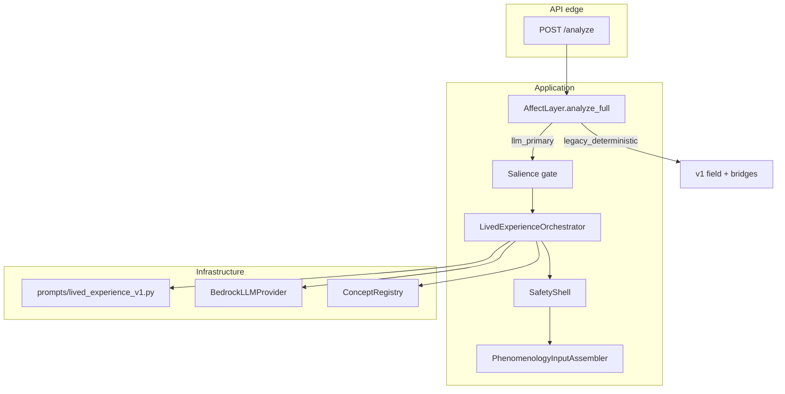
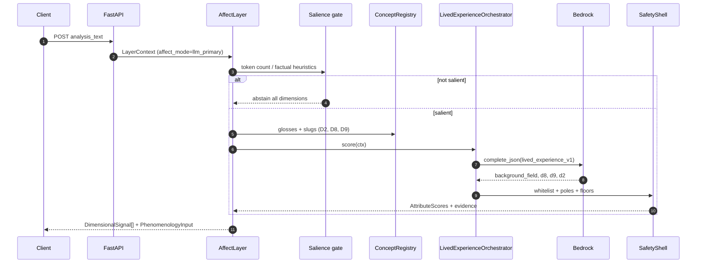
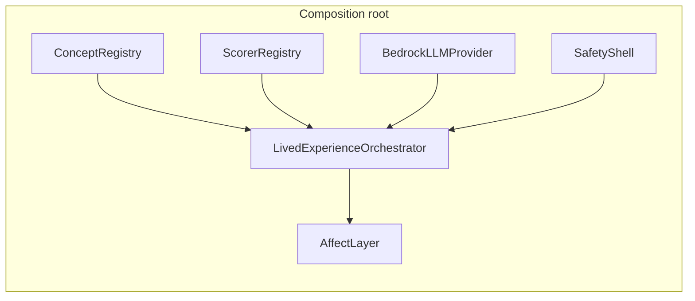
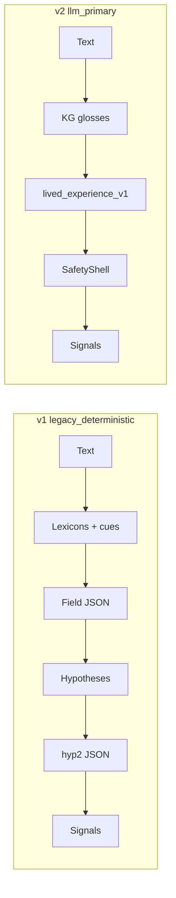

# AFF v2 — LLM-Native Lived Experience Architecture

**Status:** Implemented (opt-in via `SVARUPA_AFFECT_MODE=llm_primary`)  
**Supersedes for primary path:** static JSON bridges, lexicon-driven field synthesis, hypothesis→Rasa tables  
**Canonical v1 reference:** `aff_layer_design.md`

---

## 1. Executive summary

AFF v2 replaces the maintained static mapping chain (lexicons → field JSON → hypotheses → `hyp2*` bridges) with a **single LLM-primary call** that reads free-text lived experience and scores **closed KG vocabulary** (D2, D8, D9).

Deterministic code remains as a **safety shell**: schema validation, slug whitelist, relevance floors, pole math, guṇa reweighting, abstention, provenance.

### Modes


| `SVARUPA_AFFECT_MODE`            | Behavior                                              |
| -------------------------------- | ----------------------------------------------------- |
| `legacy_deterministic` (default) | v1 pipeline — lexicons, field synthesis, JSON bridges |
| `llm_primary`                    | v2 pipeline — `LivedExperienceOrchestrator`           |


---


## 2. Design principles

1. **Text-native reading** — model sees passage + steward glosses from `concept_registry`.
2. **KG-grounded outputs** — only slugs from `svarupa_concept_layer` ∩ `svarupa_layer_scorer`.
3. **Degrade, never fabricate** — LLM failure → abstain; no silent JSON fallback in v2.
4. **Recognition, not diagnosis** — system contract + rationale lint.
5. **Relevance ≠ confidence** — relevance on attributes; `confidence` on process in provenance.
6. **Abstention is valid** — thin or factual text skips LLM or honors `abstain: true`.

---


## 3. Architecture




### Component map


| Component                     | Path                                                | Role                                                    |
| ----------------------------- | --------------------------------------------------- | ------------------------------------------------------- |
| `LivedExperienceOrchestrator` | `application/lived_experience_orchestrator.py`      | Gate, prompt, Bedrock call, reconcile                   |
| `SafetyShell`                 | `application/safety_shell.py`                       | Whitelist, poles, floors, top-5 cap                     |
| `lived_experience_v1`         | `infrastructure/llm/prompts/lived_experience_v1.py` | Pinned prompt + schema + field mapper                   |
| `AffectLayer`                 | `application/analyze_affect.py`                     | Mode switch: `_analyze_llm_primary` / `_analyze_legacy` |


---


## 4. Sequence diagram




---


## 4. `POST /v2/analyze` — step-by-step pipeline

The v2 HTTP surface **always** runs `affect_mode=llm_primary`. On the combined app it is mounted at `/v2/analyze`; on `app_v2` the same handler is at `/analyze`. Unlike v1 `POST /analyze`, v2 does **not** branch on `SVARUPA_AFFECT_MODE` — the router hard-wires primary mode via `mappers_v2.to_v2_context`.

### 4.1 Composition root (startup)

On app startup (`api/app.py` → `get_layer()`):

1. `build_default_layer()` wires both legacy and primary paths into one `AffectLayer`.
2. `build_concept_registry()` loads AFF vocabulary from MySQL `svarupa_concept_layer` or `data/kg/aff_concept_layer.v1.json`.
3. `build_scorer_registry()` loads emit dimensions from `svarupa_layer_scorer`.
4. `LivedExperienceOrchestrator` is constructed with `BedrockLLMProvider`, `SafetyShell`, and registries.
5. **Emit set** = `concept_registry.affinity ∩ scorer_registry.emit_dimensions` (currently **D2, D8, D9**).




### 4.2 HTTP request → domain context

**Step 1 — Parse body** (`LivedExperienceAnalyzeRequest` in `api/dtos_v2.py`):


| Field                  | Role                                                                  |
| ---------------------- | --------------------------------------------------------------------- |
| `request_id`           | Trace id (UUID auto-generated if omitted)                             |
| `analysis_text`        | First-person or narrative lived experience (required, min length 1)   |
| `locale`               | Default `en`                                                          |
| `shared_features`      | Optional PHE valence/arousal, NAR temporal cues — **supporting only** |
| `options.latency_mode` | `fast` | `standard` | `deep` — controls multi-sample reconcile        |
| `options.force`        | Bypass pre-LLM salience gate (`force_llm_primary`)                    |


**Step 2 — Map to** `LayerContext` (`api/mappers_v2.py` → `to_v2_context`):


| `LayerContext` field | v2 value                           |
| -------------------- | ---------------------------------- |
| `affect_mode`        | `"llm_primary"`                    |
| `enable_llm_primary` | `True`                             |
| `force_llm_primary`  | `req.options.force`                |
| `enable_llm_assist`  | `False` (v1 field-assist disabled) |
| `latency_mode`       | from request options               |


**Step 3 — Invoke use case** (`routes_v2.analyze_lived_experience`):

```python
ctx = to_v2_context(request)
result = await layer.analyze_full(ctx)   # → AnalyzeResult
return to_v2_response(result, dimension_registry)
```

If Bedrock is unavailable and `SVARUPA_LLM_STRICT=1`, raises **503** `llm_primary_unavailable`.

### 4.3 `AffectLayer.analyze_full` — mode dispatch

```python
mode = ctx.affect_mode or self._affect_mode
if mode == "llm_primary":
    return await self._analyze_llm_primary(ctx)
return await self._analyze_legacy(ctx)
```

For `/v2/analyze`, only `_analyze_llm_primary` runs. The legacy path (lexicons → field synthesis → hypotheses → JSON bridges) is **not invoked**.

### 4.4 `_analyze_llm_primary` — layer assembly

After `LivedExperienceOrchestrator.score(ctx)` returns `LivedExperienceResult`:


| Step | Action                                                         | Output                                                                                             |
| ---- | -------------------------------------------------------------- | -------------------------------------------------------------------------------------------------- |
| 1    | `score(ctx)`                                                   | `field`, `appraisal`, `patterns`, `scores_by_dimension`, `evidence_by_dimension`, provenance flags |
| 2    | Build single `ForegroundEpisode` spanning full `analysis_text` | One episode with LLM field + patterns                                                              |
| 3    | `drivers.reconstruct(text, field, appraisal, CueBundle())`     | Affect drivers (deterministic, text-based)                                                         |
| 4    | `build_uncertainty(lx, text, n_segments)`                      | `UncertaintyProfile`                                                                               |
| 5    | `_build_signals_llm_primary(...)`                              | `DimensionalSignal[]` per emit dimension                                                           |
| 6    | `assembler.assemble(...)`                                      | `PhenomenologyInput` for upstream fusion                                                           |
| 7    | Return `AnalyzeResult(signals, phenomenology_input)`           |                                                                                                    |


**Not produced on primary path:** `EmotionHypothesis[]`, JSON bridge evidence, lexicon-driven field synthesis, v1 `field_assist`.

### 4.5 Response mapping

`to_v2_response` wraps `application/mappers.to_response` and adds:


| Field                      | Meaning                                            |
| -------------------------- | -------------------------------------------------- |
| `affect_mode`              | Always `"llm_primary"`                             |
| `llm_primary_used`         | Bedrock returned a usable payload                  |
| `llm_primary_attempted`    | A scoring attempt was made                         |
| `llm_primary_failure`      | Error when attempted but not used                  |
| `llm_primary_gate_reasons` | Salience / abstain codes                           |
| `abstained_dimensions`     | `dimension_name` for signals with `abstained=true` |
| `signals[]`                | Per-dimension fusion envelope                      |
| `attribute_scores[]`       | Flattened aggregate across signals                 |
| `field_axes[]`             | Hierarchical field from `background_field`         |
| `phenomenology_input`      | Curated object for PHE / fusion                    |


---


## 5. `LivedExperienceOrchestrator.score` — algorithm

Single entry point: `async score(ctx: LayerContext) -> LivedExperienceResult`.

### 5.1 Control-flow decision tree

```
score(ctx)
│
├─[A] ctx.enable_llm_primary == False
│      → return neutral abstain (reason: llm_primary_disabled)
│
├─[B] salience_gate(ctx) == False
│      → return abstain WITHOUT Bedrock call
│         (reasons: text_too_short | factual_schedule)
│
├─[C] vocabulary_blocks() empty
│      → return abstain, attempted=True
│         (reason: empty_vocabulary)
│
├─[D] build_prompt + collect_samples(n)
│      n = 3 if latency_mode==DEEP else 1
│      │
│      ├─ no valid samples after 3 retries each
│      │     → abstain (reason: llm_unusable)
│      │
│      └─ reconcile(samples) when n>1
│
├─[E] merged.abstain == True
│      → honor LLM abstention (reason: llm_abstain)
│         field reconstructed; scores_by_dimension = {}
│
└─[F] success path
       ├─ field_from_payload(merged)
       ├─ appraisal_from_payload, patterns_from_payload
       ├─ _score_dimensions(merged, field)  → SafetyShell + guṇa modulation
       └─ return LivedExperienceResult(used=True, attempted=True)
```


### 5.2 Salience gate (pre-LLM)

Implemented in `_salience_gate`. Cheap deterministic filter before Bedrock.


| Priority | Condition                                    | Pass?   | `gate_reasons`          |
| -------- | -------------------------------------------- | ------- | ----------------------- |
| 1        | `ctx.force_llm_primary`                      | **yes** | `["force_llm_primary"]` |
| 2        | `len(tokenize(text)) < 4`                    | **no**  | `["text_too_short"]`    |
| 3        | `_FACTUAL_RE.search(text)` AND tokens `< 18` | **no**  | `["factual_schedule"]`  |
| 4        | otherwise                                    | **yes** | `[]`                    |


`_FACTUAL_RE` matches schedule-like tokens: `meeting`, `scheduled`, `conference room`, `agenda`, `minutes`, `second floor`.

When blocked: returns neutral `background_field`, empty scores, `used=False`, `attempted=False`, `abstained=True`.

### 5.3 Vocabulary assembly

For each `dimension_id` in `self._emit_dimensions` where `dim ∈ {2, 8, 9}`:

1. `allowed_slugs = scorer_registry.output_slugs(dim)` — if empty, fall back to `concept_registry.slugs(dim)`.
2. `glosses = concept_registry.glosses(dim, slugs)` — steward text, truncated to 400 chars in prompt.
3. Build `vocabulary: dict[int, list[{slug, gloss}]]` injected into Bedrock user prompt.

**KG closure rule:** The LLM is instructed to use slug values only from these blocks. The safety shell enforces this post-hoc.

### 5.4 Bedrock invocation (`lived_experience_v1`)

**Pinned prompt:** `infrastructure/llm/prompts/lived_experience_v1.py` (`PROMPT_VERSION = "lived_experience_v1"`).


| Parameter     | Value                                           | Rationale                           |
| ------------- | ----------------------------------------------- | ----------------------------------- |
| `system`      | `SYSTEM_PROMPT`                                 | Recognition-not-diagnosis contract  |
| `temperature` | `0.2`                                           | Low variance for scoring stability  |
| `max_tokens`  | `SVARUPA_LLM_PRIMARY_MAX_TOKENS` (default 4096) | Room for field + 3 dimension blocks |
| `timeout_s`   | `SVARUPA_LLM_PRIMARY_TIMEOUT_S` (default 60)    | Per-sample budget                   |


**Retry loop** (`_collect_samples` → `one()`): up to **3 attempts** per sample. On `LivedExperienceValidationError`, append correction hint to prompt and retry. On `ModelUnavailable`, fail immediately for that sample.

**Parallel samples:** `asyncio.gather` runs `n` independent calls when `latency_mode=DEEP`.

### 5.5 Payload validation (`validate_lived_experience`)

Deterministic checks after JSON parse:

1. `normalize_payload` — alias keys (`backgroundField` → `background_field`), coerce nested field groups.
2. `background_field` must be object (hoist from misplaced groups if needed).
3. `confidence ∈ [0, 1]`.
4. Each `d8`/`d9`/`d2` item: `attribute` + `relevance ∈ [0, 1]`.
5. **Philosophy lint:** rationale must not match `_DIAGNOSTIC_DENYLIST` (`you are`, `diagnos`, `disorder`, `patient suffers`, …).


### 5.6 Multi-sample reconciliation (`_reconcile`)

When `latency_mode=DEEP` and `n=3`:


| Field              | Merge rule                                                                   |
| ------------------ | ---------------------------------------------------------------------------- |
| `abstain`          | Majority vote: abstain if `≥ n/2` samples abstained                          |
| `confidence`       | Arithmetic mean across samples                                               |
| `background_field` | Per-axis-value **median** across samples (`_median_background`)              |
| `d8`, `d9`, `d2`   | Per-slug **median relevance**; sort desc; keep top 5 (`_merge_score_blocks`) |


### 5.7 Dimension scoring (`_score_dimensions`)

Processing order: sorted `emit_dimensions`. Dimension blocks map:


| `dimension_id` | LLM block key | Default `durability`          |
| -------------- | ------------- | ----------------------------- |
| 8              | `d8`          | `enduring` (sthāyībhāva)      |
| 9              | `d9`          | `transient` (vyabhicārībhāva) |
| 2              | `d2`          | `enduring` (felt guṇa tone)   |


**Algorithm per dimension:**

```
items = merged[block_key]
allowed = _allowed_slugs(dimension_id)
attrs, evidence = safety_shell.apply_dimension_scores(
    items, dimension_id, field, allowed_slugs=allowed, default_durability
)
if dimension_id in (8, 9) and d2_scores already computed:
    attrs = _apply_guna_modulation_simple(attrs, softmax(d2_relevances))
scores_by_dimension[dimension_id] = attrs
```

**Guṇa modulation** couples D2 felt tone to D8/D9 attribute salience:

```
weights = softmax({a.attribute: a.relevance for a in d2_scores})
for attr in d8_or_d9_attrs:
    g = weights.get(attr.attribute, 0)    # direct slug match on sattva/rajas/tamas
    attr.relevance = clip(attr.relevance * (1 + β * g))    # β = 0.3
```

---


## 6. `SafetyShell` — deterministic post-LLM algorithm

The LLM **proposes** scores; the shell **disposes**. No slug outside the whitelist survives.

### 6.1 Per-item pipeline (`apply_dimension_scores`)

For each raw dict in the LLM dimension array:

```
raw_slug = item["attribute"]
slug     = canonical_slug(raw_slug)
if slug ∉ allowed_slugs:                    CONTINUE (drop)
rel      = saturate(float(item["relevance"]))
if rel < 0.15:                              CONTINUE (drop)   # _RELEVANCE_ITEM_FLOOR
state    = _resolve_state(item, slug, field)
dur      = _resolve_durability(item, default_for_dimension)
APPEND AttributeScore(attribute=emit_slug, relevance=round(rel,4), state, dimension_id, durability)
APPEND Evidence(kind=MAPPING_PATH, detail=rationale[+span], weight=rel)
```

Sort by `relevance` descending → keep **top 5** (`_TOP_K = 5`).

### 6.2 State pole resolution (`_resolve_state`)

```
if item["state"] is valid StatePole string:
    return StatePole(item["state"])
rule = d8_pole_rules.get(slug) or "intensity"     # data/pole_maps/d8_poles.v1.json
return select_pole(rule, intensity, arousal, regulation)
```

Field scalars (`intensity`, `arousal`, `regulation`) are read from the LLM-reconstructed `AffectiveField.core` and `.regulation`.

`select_pole` **rules** (`domain/scoring.py`):


| Rule                        | → `excess`                           | → `deficiency`     | → `balance`                           |
| --------------------------- | ------------------------------------ | ------------------ | ------------------------------------- |
| `intensity` (default)       | `intensity ≥ 0.6` ∧ `arousal ≥ 0.55` | `intensity ≤ 0.15` | otherwise                             |
| `equanimity` (e.g. `shama`) | `arousal ≥ 0.6`                      | `intensity ≤ 0.2`  | `regulation ≥ 0.55` ∧ `arousal ≤ 0.5` |


### 6.3 Dimension-level abstention

After shell processing, `AffectLayer._build_signals_llm_primary` computes:

```
dim_rel = dimension_relevance([a.relevance for a in attrs])
abstained = (dim_rel < SVARUPA_ABSTAIN_RELEVANCE_FLOOR) or (not attrs)    # default floor 0.12
```

`dimension_relevance` is a **soft max-pool**:

```
dimension_relevance(scores) = clip(0.75 * max(scores) + 0.25 * mean(scores))    # λ = 0.25
```

If abstained: signal emitted with `attribute_scores=[]`, `relevance=0`, `state_hint.state=unclear`.

---


## 7. Scoring mathematics reference

All functions live in `domain/scoring.py`. Pure, deterministic, no I/O.


| Function                         | Formula                | Used where                        |
| -------------------------------- | ---------------------- | --------------------------------- |
| `clip(x, 0, 1)`                  | `max(0, min(1, x))`    | All public scores                 |
| `saturate(x)`                    | `1 − e^(−γx)`, γ=1.2   | Per-item relevance after LLM      |
| `dimension_relevance`            | `0.75·max + 0.25·mean` | Dimension signal relevance        |
| `softmax(dict)`                  | exp-normalize          | D2 weights for guṇa modulation    |
| `select_pole(rule, I, A, R)`     | rule table             | State pole when LLM omits `state` |
| `build_uncertainty_profile(...)` | composite + cap        | Process `confidence` on signals   |


**Uncertainty composition** (primary path):

```
length_factor = clip(token_count / 25)
components = {MODEL, INPUT_AMBIGUITY, MIXED_AFFECT, CONTRADICTORY_EVIDENCE,
              IRONY, INSUFFICIENT_CONTEXT, COVERAGE}
base = clip(0.45·evidence_strength + 0.35·source_agreement + 0.20·coverage)
overall = clip(base * (1 − κ·max(components)))     # κ = 0.3
```

On the primary path: `source_agreement = model_margin = LLM process confidence`; `mixed_valence = irony = 0`.

**Critical invariant:** `attribute_scores[].relevance` measures **worth surfacing**; `signals[].confidence` / `uncertainty.overall` measures **process** trust — never collapsed.

---


## 8. Signal and phenomenology assembly


### 8.1 `DimensionalSignal` (per emit dimension)

Built by `_build_signals_llm_primary`:


| Field              | Source                                                                  |
| ------------------ | ----------------------------------------------------------------------- |
| `dimension_id`     | 2, 8, or 9                                                              |
| `relevance`        | `dimension_relevance(attrs)` or `0` if abstained                        |
| `confidence`       | `uncertainty.overall`                                                   |
| `attribute_scores` | Top ≤5 kept attributes (empty if abstained)                             |
| `state_hint`       | `{state: top_attr.state, confidence: uncertainty.overall}` or `unclear` |
| `evidence`         | Up to 3 `MAPPING_PATH` evidences from safety shell                      |
| `abstained`        | bool                                                                    |
| `provenance`       | LLM-primary provenance stamp                                            |


### 8.2 `PhenomenologyInput`

Assembled by `PhenomenologyInputAssembler` — the single curated object downstream layers consume:

- `background_field` — hierarchical `AffectiveField` from LLM `background_field`
- `foreground_episodes` — one episode spanning full text
- `appraisal`, `experiential_patterns` — from LLM optional blocks
- `emotion_hypotheses` — **empty** on primary path
- `uncertainty`, `provenance`, `evidence_summary`

---


## 9. Failure and abstention matrix


| Stage                        | `llm_primary_used` | `llm_primary_attempted` | `attribute_scores`    | Typical `gate_reasons`               |
| ---------------------------- | ------------------ | ----------------------- | --------------------- | ------------------------------------ |
| Primary disabled             | false              | false                   | empty                 | `llm_primary_disabled`               |
| Salience gate                | false              | false                   | empty                 | `text_too_short`, `factual_schedule` |
| Empty vocabulary             | false              | true                    | empty                 | `empty_vocabulary`                   |
| Bedrock / validation failure | false              | true                    | empty                 | `llm_unusable`                       |
| LLM `abstain:true`           | true               | true                    | empty                 | `llm_abstain`                        |
| Shell drops all items        | true               | true                    | empty (dim abstained) | —                                    |
| Success                      | true               | true                    | populated             | `[]` or `force_llm_primary`          |


**Design rule:** No silent fallback to v1 JSON bridges. Failure modes produce abstention, not fabricated signals.

---


## 10. LLM contract (`lived_experience_v1`)

**Prompt version:** `lived_experience_v1`  
**Pinned in:** `infrastructure/llm/prompts/lived_experience_v1.py`

### Input to prompt

- `analysis_text`
- Closed vocabulary blocks per dimension (slug + gloss excerpt from KG)
- Optional `SharedFeatures` hints (PHE valence/arousal, NAR temporal cues) — supporting only


### Output schema (top-level)


| Key                     | Type   | Purpose                             |
| ----------------------- | ------ | ----------------------------------- |
| `abstain`               | bool   | Honor thin / affect-free input      |
| `confidence`            | float  | Process confidence [0,1]            |
| `background_field`      | object | Hierarchical field axes             |
| `appraisal`             | object | Optional appraisal dimensions       |
| `experiential_patterns` | array  | Pattern type strings                |
| `d8`                    | array  | Enduring sthāyībhāva scores         |
| `d9`                    | array  | Transient vyabhicārī scores         |
| `d2`                    | array  | Felt guṇa tone (sattva/rajas/tamas) |


Each score item: `{ attribute, relevance, state?, durability?, rationale?, span? }`.

### Post-processing (deterministic)

1. Validate schema + philosophy lint on rationales
2. Whitelist slugs via `concept_registry`
3. Drop items with `relevance < 0.15`
4. Apply `select_pole()` when `state` omitted (uses `pole_maps/d8_poles.v1.json` for D8)
5. Reweight D8/D9 via D2 softmax modulation (`beta=0.3`)
6. Abstain dimension if `dimension_relevance < SVARUPA_ABSTAIN_RELEVANCE_FLOOR` (default 0.12)

---


## 11. Provenance

`Provenance` extended for v2:


| Field                      | Meaning                                  |
| -------------------------- | ---------------------------------------- |
| `affect_mode`              | `llm_primary` | `legacy_deterministic`   |
| `llm_primary_used`         | Bedrock returned usable payload          |
| `llm_primary_attempted`    | Call was made                            |
| `llm_primary_failure`      | Error string when attempted but not used |
| `llm_primary_gate_reasons` | Salience / abstain reasons               |
| `prompt_version`           | `lived_experience_v1` when primary used  |
| `samples`                  | 1 (STANDARD) or 3 (DEEP reconcile)       |


---


## 12. Configuration


| Env var                           | Default                | Meaning                                                |
| --------------------------------- | ---------------------- | ------------------------------------------------------ |
| `SVARUPA_AFFECT_MODE`             | `legacy_deterministic` | `llm_primary` enables v2 on v1 `/analyze`              |
| `SVARUPA_ENABLE_LLM_PRIMARY`      | `1`                    | Master switch for primary provider wiring              |
| `SVARUPA_FORCE_LLM_PRIMARY`       | `0`                    | Bypass salience gate globally                          |
| `SVARUPA_LLM_PRIMARY_TIMEOUT_S`   | `60`                   | Bedrock timeout                                        |
| `SVARUPA_LLM_PRIMARY_MAX_TOKENS`  | `4096`                 | Response budget                                        |
| `SVARUPA_ABSTAIN_RELEVANCE_FLOOR` | `0.12`                 | Dimension abstention                                   |
| `SVARUPA_LLM_STRICT`              | `0`                    | Fail fast if Bedrock unavailable in `llm_primary` mode |


v2 `/v2/analyze` request overrides: `options.force` → `force_llm_primary`; `options.latency_mode` → sample count.

---


## 13. What v2 removes from the primary path

When `affect_mode=llm_primary`, these are **not used**:

- `hyp2sthayi.v2.json`, `hyp2vyabhi.v2.json`
- `field_synthesis.v2.json`, `patterns.v1.json`, `appraisal_rules.v1.json`
- `affect_anchors.v1.json`, lexicons, linguistic cues
- `EmotionHypothesisGenerator` → JSON bridge chain

**Retained:**

- `data/kg/aff_concept_layer.v1.json` (or MySQL) — vocabulary + glosses
- `data/pole_maps/d8_poles.v1.json` — pole fallback math
- `svarupa_layer_scorer` — emit dimensions

Legacy files remain on disk for `legacy_deterministic` mode and eval comparison.

---


## 14. HTTP API (FastAPI)

Two ASGI entry points:


| App module                  | Run command                                         | Endpoints                                   |
| --------------------------- | --------------------------------------------------- | ------------------------------------------- |
| `svarupa_affect.api.app`    | `uvicorn svarupa_affect.api.app:app`                | v1: `POST /analyze`; v2: `POST /v2/analyze` |
| `svarupa_affect.api.app_v2` | `uvicorn svarupa_affect.api.app_v2:app --port 8001` | v2 only at root: `POST /analyze`            |


### v2 endpoints


| Method | Path (combined app) | Description                                          |
| ------ | ------------------- | ---------------------------------------------------- |
| `GET`  | `/v2/health`        | Liveness                                             |
| `GET`  | `/v2/meta`          | Prompt version, emit dimensions, Bedrock config hint |
| `POST` | `/v2/analyze`       | LLM-primary lived-experience analysis                |


### v2 request example

```json
{
  "analysis_text": "I keep bracing until I hear back and cannot stop checking my phone.",
  "shared_features": { "valence": -0.4, "arousal": 0.7 },
  "options": { "latency_mode": "standard", "force": false }
}
```


### v2 response highlights

- `affect_mode`: always `"llm_primary"`
- `llm_primary_used` / `llm_primary_failure` — Bedrock call outcome
- `abstained_dimensions` — dimension names where relevance was below floor
- `signals[]`, `phenomenology_input` — same fusion contract as v1

Source files: `api/dtos_v2.py`, `api/mappers_v2.py`, `api/routes_v2.py`, `api/app_v2.py`.

---


## 15. Testing


| Test file                                | Coverage                                                          |
| ---------------------------------------- | ----------------------------------------------------------------- |
| `tests/test_lived_experience_primary.py` | Mock Bedrock, fear→bhaya/cinta, factual abstain, legacy unchanged |
| `tests/test_api_v2.py`                   | FastAPI `/v2/*` and standalone `app_v2` with mocked layer         |
| `tests/test_bridge.py`                   | Legacy bridge (unchanged)                                         |


Run:

```bash
PYTHONPATH=src pytest tests/test_lived_experience_primary.py -v
```

Enable v2 locally:

```bash
export SVARUPA_AFFECT_MODE=llm_primary
export AWS_REGION=us-east-1
PYTHONPATH=src python -m svarupa_affect.cli "I keep bracing until I hear back."
```

---


## 16. Migration phases


| Phase | State                                                                               |
| ----- | ----------------------------------------------------------------------------------- |
| **1** | ✅ `LivedExperienceOrchestrator` behind `SVARUPA_AFFECT_MODE=llm_primary`            |
| **2** | Parallel eval: `legacy_deterministic` vs `llm_primary` on lived-experience workbook |
| **3** | Flip default to `llm_primary` after steward sign-off                                |
| **4** | Remove legacy JSON from primary wiring; keep fixtures for regression                |


---


## 17. v1 vs v2 comparisonscripts/eval_aff_lived_experience_coverage_[v2.py](http://v2.py)




---


## 18. Open follow-ups

- Emit dimensions D19/D22/D24 via same LLM call when scorers are validated  
- Replace `guna_families.v1.json` with per-concept KG `guna_affinity`  
- `scripts/eval_rasa_bridge.py` — side-by-side legacy vs v2 coverage report  
- DEEP mode multi-sample reconcile tuning on steward gold set

