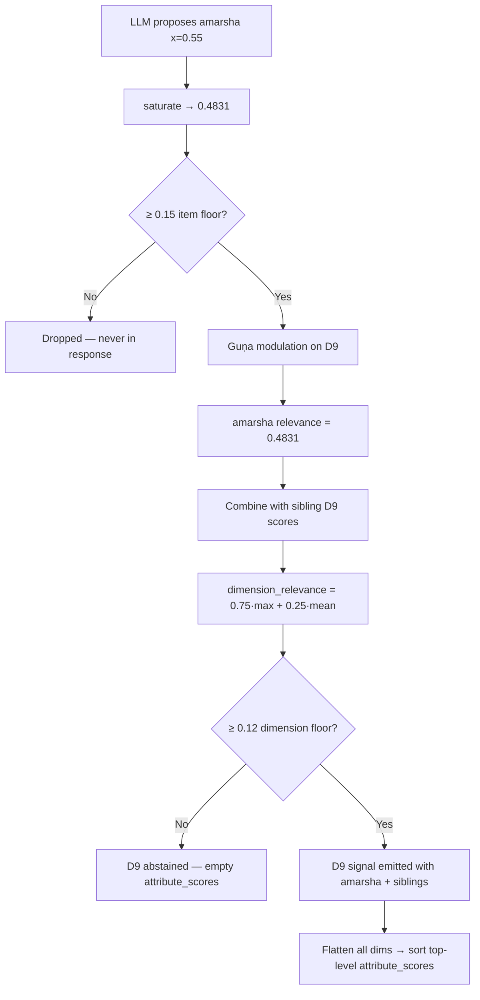

# AFF v2 relevance scoring walkthrough

How per-attribute relevance (e.g. `amarsha` at **0.4831**) is computed, how it compares to sibling
attributes, and what controls dimension-level abstention on the `/v2/analyze` path.

Example attribute from a live response:

```json
{
  "attribute": "amarsha",
  "relevance": 0.4831,
  "state": "excess",
  "dimension_name": "Vyabhicārībhāvas",
  "durability": "transient",
  "reasoning": "Selected amarsha because A simmering impatience—'I can't sit through the whole thing'—suggests restrained irritation that doesn't explode but manifests as cutting the other person off. The slow burn of not being able to tolerate the pace of another's communication. (supporting text: \"I can't sit through the whole thing when I already know the point\"). Relevance: LLM 0.55 → saturated to 0.4831 (1 − e^(−γ·x), γ=1.2), stored as 0.4831. State: excess (from LLM). Durability: transient (dimension default). Guṇa modulation (β=0.3): relevance adjusted from 0.4831 to 0.4831 using D2 softmax weight 0.0000."
}
```

---

## Two different “relevance” numbers

AFF uses relevance at **two levels**, and they behave differently:

| Level | Field | What it means |
|-------|--------|----------------|
| **Per attribute** | `attribute_scores[].relevance` | How much *this specific concept* is worth surfacing |
| **Per dimension** | `signals[].relevance` | How much the *whole dimension* (D8/D9/D2) is worth surfacing |

The `amarsha` entry’s **0.4831** is the **per-attribute** score. Sibling attributes do **not**
change each other’s individual scores. They only combine when computing the **dimension signal**
relevance.

---

## Step 1: How `amarsha` got to 0.4831

Pipeline for each LLM-proposed attribute on D9 (Vyabhicārībhāvas):

```
LLM raw relevance (x)
    → saturate(x) = 1 − e^(−1.2·x)
    → if < 0.15: DROP (never emitted)
    → guṇa modulation (D9 only, after D2 is scored)
    → round to 4 decimals → stored relevance
```

For `amarsha`:

| Step | Value |
|------|-------|
| LLM raw `x` | **0.55** |
| After saturation | **0.4831** |
| After guṇa modulation | **0.4831** (no change; D2 weight was 0.0000) |
| Emitted? | **Yes** (0.4831 ≥ 0.15 item floor) |

**Saturation formula** (`domain/scoring.py`):

```
saturate(x) = 1 − e^(−γ·x)     # γ = GAMMA = 1.2
```

Guṇa modulation only applies to D8/D9, not D2. It multiplies by `(1 + β × g)` where `β = 0.3` and
`g` is the D2 softmax weight for the matching guṇa family (`rajas` / `sattva` / `tamas`). `amarsha`
is not a guṇa slug, so `g = 0` and the score is unchanged.

---

## Step 2: Per-item floor — the first gate

Before an attribute appears in the response at all, the safety shell drops weak items
(`application/safety_shell.py`):

```
_RELEVANCE_ITEM_FLOOR = 0.15
_TOP_K = 5
```

Anything with saturated relevance **< 0.15** is silently dropped.

**What raw LLM score is needed to survive?**

Solve `1 − e^(−1.2x) ≥ 0.15` → **x ≈ 0.14 or higher**.

| Raw LLM `x` | Saturated relevance | Emitted? |
|-------------|---------------------|----------|
| 0.55 (amarsha) | 0.4831 | Yes |
| 0.40 | ≈ 0.38 | Yes |
| 0.14 | ≈ 0.15 | Barely |
| 0.10 | ≈ 0.11 | **No** |

`amarsha` at **0.4831** is comfortably above this gate — roughly mid-range among surviving
attributes.

### Why saturation exists

Saturation maps unbounded evidence strength into **[0, 1)** with diminishing returns:

- Prevents raw LLM scores (e.g. 0.85) from reading as near-certainty
- γ is tuned so one strong hypothesis lands around **~0.6–0.7**, not 1.0
- Keeps **relevance** (worth surfacing) separate from **confidence** (process trust)

See `documentation/design/aff_layer_design.md` §5.2 and
`documentation/design/aff_layer_design_v2_llm_native.md` §6–7.

---

## Step 3: Siblings within D9 — dimension soft max-pool

Other D9 attributes in the same response (e.g. `krodha`, `cinta`, `asuya`) each get their **own**
saturated score. They do not modify `amarsha`’s 0.4831.

They **do** combine into the **Vyabhicārībhāvas signal** relevance (`domain/scoring.py`):

```
dimension_relevance(scores) = clip(0.75 × max(scores) + 0.25 × mean(scores))    # λ = 0.25
```

### Worked examples with `amarsha` = 0.4831

**Case A — `amarsha` alone on D9**

```
R = 0.75 × 0.4831 + 0.25 × 0.4831 = 0.4831
```

**Case B — `amarsha` (0.4831) + weaker sibling `krodha` (0.20)**

```
mean = (0.4831 + 0.20) / 2 = 0.3416
R   = 0.75 × 0.4831 + 0.25 × 0.3416
    = 0.3623 + 0.0854 = 0.4477
```

The weaker sibling **pulls the dimension down slightly**, but the dimension is still driven mostly
(75%) by the strongest attribute.

**Case C — `amarsha` (0.4831) + strong sibling `asuya` (0.62)**

```
mean = (0.4831 + 0.62) / 2 = 0.5516
R   = 0.75 × 0.62 + 0.25 × 0.5516
    = 0.4650 + 0.1379 = 0.6029
```

Multiple strong vyabhicārī bhāvas **lift the dimension signal** above any single attribute.

**Case D — three moderate siblings**

| Attribute | Relevance |
|-----------|-----------|
| amarsha | 0.4831 |
| cinta | 0.35 |
| kshama | 0.28 |

```
max  = 0.4831
mean = (0.4831 + 0.35 + 0.28) / 3 = 0.3710
R    = 0.75 × 0.4831 + 0.25 × 0.3710 = 0.4550
```

---

## Step 4: Dimension abstention — the second gate

After per-dimension scores are assembled (`application/analyze_affect.py`):

```
relevance = dimension_relevance([a.relevance for a in attrs])
abstained = relevance < _RELEVANCE_FLOOR or not attrs
kept      = [] if abstained else attrs[:5]
```

`_RELEVANCE_FLOOR = 0.12` (overridable via `SVARUPA_ABSTAIN_RELEVANCE_FLOOR`).

If abstained:

- `signals[].relevance` → **0**
- `signals[].attribute_scores` → **[]** (empty, even if items passed individually)
- dimension name appears in `abstained_dimensions`

### For `amarsha` specifically

With **any single emitted attribute ≥ 0.15**:

```
dimension_relevance ≥ 0.15  >  0.12 floor
```

So if `amarsha` is in the response at **0.4831**, **Vyabhicārībhāvas almost certainly did not
abstain**.

In practice, dimension abstention on D9 usually means:

- LLM returned **no D9 items**, or
- all proposed D9 items were **filtered out** (not in whitelist, or saturated below **0.15**), or
- LLM set top-level **`abstain: true`**

—not that `amarsha`’s 0.4831 was “too low” for the dimension.

### When would D9 abstain despite the LLM proposing things?

Example: LLM proposes three weak D9 hits:

| Attribute | Raw LLM | Saturated | Emitted? |
|-----------|---------|-----------|----------|
| amarsha | 0.10 | 0.11 | **No** (< 0.15) |
| krodha | 0.08 | 0.09 | **No** |
| cinta | 0.12 | 0.13 | **No** |

```
attrs = []  →  dimension_relevance = 0  →  abstained
```

Nothing appears in `attribute_scores`, and `Vyabhicārībhāvas` lands in `abstained_dimensions`.

---

## Step 5: Comparing across dimensions (D8, D9, D2)

Top-level `attribute_scores` **flattens all dimensions** and sorts by individual relevance
descending (`application/mappers.py`):

```python
def _aggregate_attribute_scores(signals):
    merged = []
    for signal in signals:
        merged.extend(signal.attribute_scores)
    merged.sort(key=lambda score: score.relevance, reverse=True)
    return merged
```

So `amarsha` at **0.4831** competes for rank with D8 and D2 attributes too.

Illustrative full response:

| Rank | Attribute | Dimension | Relevance |
|------|-----------|-----------|-----------|
| 1 | bhaya | Sthāyībhāvas (D8) | 0.6522 |
| 2 | rajas | Triguṇa (D2) | 0.5804 |
| 3 | **amarsha** | **Vyabhicārībhāvas (D9)** | **0.4831** |
| 4 | cinta | Vyabhicārībhāvas (D9) | 0.41 |

- `amarsha` is the **top D9** attribute in this example.
- It ranks **3rd overall** — strong enough to surface, but not the dominant signal.
- `state_hint` on the D9 signal uses the **top D9 attribute’s state** (`amarsha` → `excess` if it’s
  first on D9).

---

## Step 6: What would push `amarsha` higher?

### A. Higher LLM raw relevance (most direct)

| Raw LLM `x` | Saturated relevance |
|-------------|---------------------|
| 0.55 (example) | **0.4831** |
| 0.70 | **~0.57** |
| 0.85 | **~0.65** |
| 1.00 | **~0.70** (ceiling effect) |

Even pushing the LLM to **1.0** only gets ~**0.70** after saturation — by design.

### B. Stronger D2 guṇa alignment (D9 only)

If D2 had scored `rajas` dominantly, e.g. softmax weight **0.65**:

```
new_rel = 0.4831 × (1 + 0.3 × 0.65)
        = 0.4831 × 1.195
        ≈ 0.577
```

That is the main deterministic boost available **after** saturation for D9 attributes.

### C. More D9 siblings (does not change `amarsha`, lifts dimension signal)

Extra strong vyabhicārī hits raise `signals[D9].relevance` but leave `amarsha` at 0.4831.

---

## End-to-end flow



---

## Summary

1. **0.4831 is a solid mid-tier surfacing score** — well above the 0.15 survival gate, well below
   the ~0.65–0.70 “very strong” saturation band.
2. **It likely kept D9 alive** — one attribute at 0.4831 gives dimension relevance 0.4831, far above
   the 0.12 abstention floor.
3. **Siblings affect the D9 signal’s aggregate relevance, not `amarsha`’s own score** — compare
   siblings to see whether D9 is “one clear hit” vs “several moderate vyabhicārī patterns.”
4. **To rank higher in top-level `attribute_scores`**, `amarsha` needs a higher LLM raw score
   and/or favorable guṇa modulation — saturation caps how much any single boost can matter.

---

## Source references

| Topic | Location |
|-------|----------|
| `saturate`, `dimension_relevance`, `GAMMA`, `LAMBDA` | `src/svarupa_affect/domain/scoring.py` |
| Per-item floor, top-k, reasoning | `src/svarupa_affect/application/safety_shell.py` |
| Guṇa modulation on D8/D9 | `src/svarupa_affect/application/lived_experience_orchestrator.py` |
| Dimension abstention, signal assembly | `src/svarupa_affect/application/analyze_affect.py` |
| Top-level flatten + sort | `src/svarupa_affect/application/mappers.py` |
| v2 design (safety shell, scoring table) | `documentation/design/aff_layer_design_v2_llm_native.md` |
| v1 scoring philosophy (§5.2 saturation) | `documentation/design/aff_layer_design.md` |
